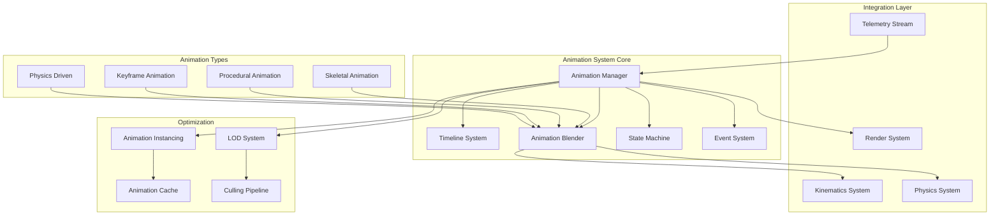

# Animation System Architecture for Rover 3D Visualization

## Executive Summary

This document outlines the comprehensive animation system architecture for the rover 3D visualization platform. The system supports multiple animation types including skeletal, procedural, keyframe-based, and physics-driven animations. It provides a unified API for animation control, timeline management, and seamless integration with existing kinematics and physics systems.

## Table of Contents

1. [System Overview](#system-overview)
2. [Architecture Components](#architecture-components)
3. [Animation Types](#animation-types)
4. [Core Systems](#core-systems)
5. [Integration Architecture](#integration-architecture)
6. [Performance Optimization](#performance-optimization)
7. [API Design](#api-design)
8. [Implementation Roadmap](#implementation-roadmap)

## System Overview

The animation system is designed as a modular, extensible framework that manages all aspects of rover articulation and movement. It operates as a middleware layer between the visualization components and the underlying physics/kinematics engines.

### Key Design Principles

1. **Separation of Concerns**: Animation logic is decoupled from rendering and physics
2. **Performance First**: Optimized for real-time 60 FPS visualization
3. **Extensibility**: Plugin architecture for custom animation types
4. **Determinism**: Reproducible animations for mission planning
5. **Telemetry Integration**: Real-time animation driven by rover data

### System Architecture Diagram



## Architecture Components

### 1. Animation Manager

The central orchestrator for all animation activities.

```typescript
interface AnimationManager {
  // Core functionality
  play(animationId: string, options?: PlayOptions): AnimationHandle;
  pause(handle: AnimationHandle): void;
  stop(handle: AnimationHandle): void;
  
  // Timeline control
  seek(handle: AnimationHandle, time: number): void;
  setSpeed(handle: AnimationHandle, speed: number): void;
  
  // Registration
  registerAnimation(animation: Animation): string;
  registerAnimationType(type: AnimationType): void;
  
  // Global controls
  pauseAll(): void;
  resumeAll(): void;
  setGlobalTimeScale(scale: number): void;
}
```

### 2. Timeline System

Manages temporal aspects of animations and sequencing.

```typescript
interface Timeline {
  // Track management
  addTrack(track: AnimationTrack): void;
  removeTrack(trackId: string): void;
  
  // Sequencing
  sequence(animations: AnimationSequence[]): TimelineHandle;
  parallel(animations: Animation[]): TimelineHandle;
  
  // Events
  addMarker(time: number, callback: TimelineCallback): void;
  onComplete(callback: () => void): void;
  
  // Control
  play(): void;
  pause(): void;
  seek(time: number): void;
  
  // Properties
  duration: number;
  currentTime: number;
  isPlaying: boolean;
}
```

### 3. Animation Blender

Handles smooth transitions between animations and layering.

```typescript
interface AnimationBlender {
  // Blending operations
  blend(source: AnimationState, target: AnimationState, weight: number): AnimationState;
  crossfade(from: Animation, to: Animation, duration: number): BlendHandle;
  
  // Layering
  addLayer(layer: AnimationLayer): void;
  setLayerWeight(layerId: string, weight: number): void;
  setLayerMask(layerId: string, mask: AnimationMask): void;
  
  // Advanced blending
  additiveBlend(base: AnimationState, additive: AnimationState, weight: number): AnimationState;
  inertialization(current: AnimationState, target: AnimationState, params: InertializationParams): AnimationState;
}
```

### 4. State Machine

Manages animation states and transitions for complex behaviors.

```typescript
interface AnimationStateMachine {
  // State management
  addState(state: AnimationState): void;
  addTransition(from: string, to: string, condition: TransitionCondition): void;
  
  // Runtime control
  setState(stateId: string): void;
  trigger(event: string, params?: any): void;
  
  // Queries
  getCurrentState(): AnimationState;
  canTransition(to: string): boolean;
  
  // Configuration
  setParameter(name: string, value: any): void;
  getParameter(name: string): any;
}
```

### 5. Event System

Provides event-driven animation control and synchronization.

```typescript
interface AnimationEventSystem {
  // Event registration
  on(event: AnimationEvent, handler: EventHandler): void;
  off(event: AnimationEvent, handler: EventHandler): void;
  
  // Event emission
  emit(event: AnimationEvent, data?: any): void;
  
  // Telemetry integration
  subscribeTelemetry(stream: TelemetryStream, mapper: TelemetryMapper): void;
  
  // Animation triggers
  triggerAnimation(trigger: AnimationTrigger): void;
  
  // Event types
  events: {
    ANIMATION_START: 'animationStart';
    ANIMATION_END: 'animationEnd';
    ANIMATION_LOOP: 'animationLoop';
    KEYFRAME_REACHED: 'keyframeReached';
    STATE_CHANGE: 'stateChange';
    COLLISION_DETECTED: 'collisionDetected';
  };
}
```

## Animation Types

### 1. Skeletal Animation

For articulated parts like the robotic arm and mast camera.

```typescript
interface SkeletalAnimation {
  type: 'skeletal';
  skeleton: Skeleton;
  clips: AnimationClip[];
  
  // Bone manipulation
  setBoneRotation(boneName: string, rotation: Quaternion): void;
  setBonePosition(boneName: string, position: Vector3): void;
  
  // IK integration
  applyIK(chain: IKChain, target: Vector3): void;
  
  // Constraints
  addConstraint(constraint: BoneConstraint): void;
}

interface Skeleton {
  bones: Bone[];
  hierarchy: BoneHierarchy;
  bindPose: Pose;
  
  // Utility methods
  getBone(name: string): Bone;
  updateMatrices(): void;
}
```

### 2. Procedural Animation

For dynamic, algorithm-driven animations.

```typescript
interface ProceduralAnimation {
  type: 'procedural';
  generator: AnimationGenerator;
  parameters: GeneratorParameters;
  
  // Common procedural animations
  generators: {
    wheelRotation: WheelRotationGenerator;
    suspensionBounce: SuspensionGenerator;
    antennaWobble: AntennaWobbleGenerator;
    dustParticles: DustGenerator;
    trackDeformation: TrackDeformationGenerator;
  };
}

interface AnimationGenerator {
  generate(time: number, state: RoverState, params: any): AnimationFrame;
  initialize(params: GeneratorParameters): void;
  reset(): void;
}
```

### 3. Keyframe Animation

Traditional keyframe-based animations for predefined sequences.

```typescript
interface KeyframeAnimation {
  type: 'keyframe';
  tracks: KeyframeTrack[];
  duration: number;
  
  // Interpolation
  interpolation: 'linear' | 'bezier' | 'hermite' | 'step';
  
  // Keyframe manipulation
  addKeyframe(track: string, time: number, value: any): void;
  removeKeyframe(track: string, time: number): void;
  
  // Evaluation
  evaluate(time: number): AnimationFrame;
}

interface KeyframeTrack {
  property: string;
  keyframes: Keyframe[];
  interpolation?: InterpolationType;
}
```

### 4. Physics-Driven Animation

Animations controlled by the physics simulation.

```typescript
interface PhysicsAnimation {
  type: 'physics';
  rigidBody: RigidBody;
  constraints: PhysicsConstraint[];
  
  // Physics integration
  applyForce(force: Vector3): void;
  applyImpulse(impulse: Vector3, point: Vector3): void;
  
  // Simulation
  simulate(deltaTime: number): void;
  
  // Ragdoll support
  enableRagdoll(): void;
  disableRagdoll(): void;
}
```

## Core Systems

### Timeline System Architecture

```typescript
class TimelineSystem {
  private timelines: Map<string, Timeline>;
  private globalClock: Clock;
  private timeScale: number = 1.0;
  
  // Main update loop
  update(deltaTime: number): void {
    const scaledDelta = deltaTime * this.timeScale;
    
    for (const timeline of this.timelines.values()) {
      if (timeline.isPlaying) {
        timeline.advance(scaledDelta);
        this.processMarkers(timeline);
        this.updateAnimations(timeline);
      }
    }
  }
  
  // Timeline creation
  createTimeline(config: TimelineConfig): Timeline {
    const timeline = new Timeline(config);
    this.timelines.set(timeline.id, timeline);
    return timeline;
  }
  
  // Synchronization
  syncTimelines(master: string, slaves: string[]): void {
    const masterTimeline = this.timelines.get(master);
    if (!masterTimeline) return;
    
    for (const slaveId of slaves) {
      const slave = this.timelines.get(slaveId);
      if (slave) {
        slave.currentTime = masterTimeline.currentTime;
      }
    }
  }
}
```

### Animation Blending Architecture

```typescript
class AnimationBlendTree {
  private root: BlendNode;
  
  // Blend tree evaluation
  evaluate(time: number): AnimationPose {
    return this.evaluateNode(this.root, time);
  }
  
  private evaluateNode(node: BlendNode, time: number): AnimationPose {
    switch (node.type) {
      case 'animation':
        return node.animation.evaluate(time);
        
      case 'blend':
        const left = this.evaluateNode(node.left, time);
        const right = this.evaluateNode(node.right, time);
        return this.blend(left, right, node.weight);
        
      case 'additive':
        const base = this.evaluateNode(node.base, time);
        const add = this.evaluateNode(node.additive, time);
        return this.additiveBlend(base, add, node.weight);
        
      case 'mask':
        const source = this.evaluateNode(node.source, time);
        return this.applyMask(source, node.mask);
    }
  }
  
  // Blending operations
  private blend(a: AnimationPose, b: AnimationPose, weight: number): AnimationPose {
    const result = new AnimationPose();
    
    for (const joint of a.joints) {
      const bJoint = b.getJoint(joint.name);
      if (bJoint) {
        result.addJoint({
          name: joint.name,
          rotation: Quaternion.slerp(joint.rotation, bJoint.rotation, weight),
          position: Vector3.lerp(joint.position, bJoint.position, weight),
          scale: Vector3.lerp(joint.scale, bJoint.scale, weight)
        });
      }
    }
    
    return result;
  }
}
```

### State Machine Implementation

```typescript
class AnimationStateMachine {
  private states: Map<string, State>;
  private transitions: Map<string, Transition[]>;
  private currentState: State;
  private parameters: Map<string, any>;
  
  // State transition logic
  update(deltaTime: number): void {
    // Update current state
    this.currentState.update(deltaTime);
    
    // Check transitions
    const possibleTransitions = this.transitions.get(this.currentState.id) || [];
    
    for (const transition of possibleTransitions) {
      if (this.evaluateCondition(transition.condition)) {
        this.transitionTo(transition.targetState);
        break;
      }
    }
  }
  
  private evaluateCondition(condition: TransitionCondition): boolean {
    switch (condition.type) {
      case 'parameter':
        return this.evaluateParameterCondition(condition);
      case 'time':
        return this.currentState.timeInState >= condition.time;
      case 'event':
        return this.hasEvent(condition.event);
      case 'custom':
        return condition.evaluate(this.parameters);
    }
  }
  
  private transitionTo(targetStateId: string): void {
    const targetState = this.states.get(targetStateId);
    if (!targetState) return;
    
    // Exit current state
    this.currentState.onExit();
    
    // Transition
    const transition = this.findTransition(this.currentState.id, targetStateId);
    if (transition && transition.duration > 0) {
      // Blend between states
      this.startBlendTransition(this.currentState, targetState, transition);
    }
    
    // Enter new state
    targetState.onEnter();
    this.currentState = targetState;
  }
}
```

## Integration Architecture

### Kinematics Integration

```typescript
class KinematicsAnimationBridge {
  private kinematicsSolver: KinematicsSolver;
  private animationManager: AnimationManager;
  
  // Apply animation to kinematics
  applyAnimation(animation: Animation, weight: number = 1.0): void {
    const pose = animation.evaluate(animation.currentTime);
    
    for (const joint of pose.joints) {
      const kinematicJoint = this.kinematicsSolver.getJoint(joint.name);
      if (kinematicJoint) {
        // Blend animation with current kinematics state
        kinematicJoint.targetAngle = THREE.MathUtils.lerp(
          kinematicJoint.currentAngle,
          joint.rotation.toEuler().y,
          weight
        );
      }
    }
  }
  
  // Generate animation from IK solution
  generateIKAnimation(target: Vector3, duration: number): Animation {
    const startPose = this.captureCurrentPose();
    this.kinematicsSolver.solveIK(target);
    const endPose = this.captureCurrentPose();
    
    return this.createTransitionAnimation(startPose, endPose, duration);
  }
}
```

### Physics Integration

```typescript
class PhysicsAnimationBridge {
  private physicsWorld: PhysicsWorld;
  private animationManager: AnimationManager;
  
  // Sync physics with animation
  syncPhysicsToAnimation(animation: Animation): void {
    const pose = animation.evaluate(animation.currentTime);
    
    for (const body of this.physicsWorld.bodies) {
      const joint = pose.getJoint(body.name);
      if (joint) {
        body.setPosition(joint.position);
        body.setRotation(joint.rotation);
      }
    }
  }
  
  // Record physics as animation
  recordPhysicsAnimation(duration: number): Animation {
    const frames: AnimationFrame[] = [];
    const frameRate = 60;
    const frameCount = duration * frameRate;
    
    for (let i = 0; i < frameCount; i++) {
      this.physicsWorld.step(1 / frameRate);
      frames.push(this.capturePhysicsState());
    }
    
    return new PhysicsAnimation(frames);
  }
}
```

### Telemetry Integration

```typescript
class TelemetryAnimationDriver {
  private telemetryStream: TelemetryStream;
  private animationManager: AnimationManager;
  private parameterMapping: Map<string, string>;
  
  // Drive animations from telemetry
  connectTelemetry(): void {
    this.telemetryStream.subscribe((data: TelemetryData) => {
      // Update animation parameters
      for (const [telemetryKey, animParam] of this.parameterMapping) {
        const value = data[telemetryKey];
        if (value !== undefined) {
          this.animationManager.setParameter(animParam, value);
        }
      }
      
      // Trigger event-based animations
      this.checkAnimationTriggers(data);
    });
  }
  
  private checkAnimationTriggers(data: TelemetryData): void {
    // Example: Deploy arm when reaching waypoint
    if (data.waypointReached) {
      this.animationManager.play('arm_deploy');
    }
    
    // Example: Adjust suspension based on terrain
    if (data.terrainRoughness > 0.5) {
      this.animationManager.setParameter('suspension_stiffness', 0.8);
    }
  }
}
```

## Performance Optimization

### Animation Instancing

```typescript
class AnimationInstancer {
  private instanceData: Map<string, InstancedAnimation>;
  private batchRenderer: BatchRenderer;
  
  // Create instanced animation
  createInstance(animationId: string, count: number): InstanceHandle {
    const baseAnimation = this.getAnimation(animationId);
    const instances = new InstancedAnimation(baseAnimation, count);
    
    // Allocate GPU buffers
    instances.allocateBuffers(this.batchRenderer);
    
    return instances.handle;
  }
  
  // Update all instances
  updateInstances(handle: InstanceHandle, deltaTime: number): void {
    const instances = this.instanceData.get(handle);
    if (!instances) return;
    
    // Update on GPU using compute shader
    this.batchRenderer.updateInstancedAnimation(instances, deltaTime);
  }
}
```

### LOD System

```typescript
class AnimationLODSystem {
  private lodLevels: LODLevel[];
  private camera: Camera;
  
  // Determine LOD level
  getLODLevel(object: AnimatedObject): number {
    const distance = object.position.distanceTo(this.camera.position);
    const screenSize = this.calculateScreenSize(object, distance);
    
    for (let i = 0; i < this.lodLevels.length; i++) {
      if (screenSize > this.lodLevels[i].threshold) {
        return i;
      }
    }
    
    return this.lodLevels.length - 1;
  }
  
  // Apply LOD to animation
  applyLOD(animation: Animation, lodLevel: number): Animation {
    switch (lodLevel) {
      case 0: // Full quality
        return animation;
        
      case 1: // Reduced keyframes
        return this.reduceKeyframes(animation, 0.5);
        
      case 2: // Simple interpolation
        return this.simplifyAnimation(animation);
        
      case 3: // Static pose
        return this.getStaticPose(animation);
    }
  }
}
```

### Animation Caching

```typescript
class AnimationCache {
  private cache: LRUCache<string, CompiledAnimation>;
  private maxCacheSize: number = 100 * 1024 * 1024; // 100MB
  
  // Cache compiled animation
  cache(animationId: string, animation: Animation): void {
    const compiled = this.compileAnimation(animation);
    this.cache.set(animationId, compiled);
  }
  
  // Compile animation for fast evaluation
  private compileAnimation(animation: Animation): CompiledAnimation {
    return {
      id: animation.id,
      duration: animation.duration,
      // Pre-calculate all frames at 60fps
      frames: this.precalculateFrames(animation, 60),
      // Create GPU buffer
      gpuBuffer: this.createGPUBuffer(animation)
    };
  }
}
```

## API Design

### High-Level Animation API

```typescript
// Animation service for external use
class RoverAnimationService {
  private animationManager: AnimationManager;
  private stateMachine: AnimationStateMachine;
  
  // Play predefined animations
  playAnimation(name: RoverAnimation): Promise<void> {
    return new Promise((resolve) => {
      const handle = this.animationManager.play(name);
      handle.onComplete(() => resolve());
    });
  }
  
  // Control rover components
  async deployArm(): Promise<void> {
    await this.playAnimation('arm_deploy');
    this.stateMachine.setState('arm_deployed');
  }
  
  async stowArm(): Promise<void> {
    await this.playAnimation('arm_stow');
    this.stateMachine.setState('arm_stowed');
  }
  
  async scanWithCamera(angle: number): Promise<void> {
    this.animationManager.setParameter('scan_angle', angle);
    await this.playAnimation('camera_scan');
  }
  
  // Telemetry-driven animation
  enableTelemetryAnimation(config: TelemetryConfig): void {
    this.telemetryDriver.connect(config);
  }
  
  // Manual control
  setJointAngle(jointName: string, angle: number, duration: number = 1): void {
    const animation = this.createJointAnimation(jointName, angle, duration);
    this.animationManager.play(animation);
  }
}
```

### React Hook API

```typescript
// React hook for animation control
export function useRoverAnimation() {
  const animationService = useContext(AnimationContext);
  const [isPlaying, setIsPlaying] = useState(false);
  const [currentAnimation, setCurrentAnimation] = useState<string | null>(null);
  
  const playAnimation = useCallback(async (name: RoverAnimation) => {
    setIsPlaying(true);
    setCurrentAnimation(name);
    
    try {
      await animationService.playAnimation(name);
    } finally {
      setIsPlaying(false);
      setCurrentAnimation(null);
    }
  }, [animationService]);
  
  const stopAnimation = useCallback(() => {
    animationService.stopAll();
    setIsPlaying(false);
    setCurrentAnimation(null);
  }, [animationService]);
  
  return {
    playAnimation,
    stopAnimation,
    isPlaying,
    currentAnimation,
    // Component animations
    deployArm: () => playAnimation('arm_deploy'),
    stowArm: () => playAnimation('arm_stow'),
    scanArea: () => playAnimation('camera_scan'),
    // Direct control
    setJointAngle: animationService.setJointAngle
  };
}
```

### Animation Configuration

```typescript
// Animation system configuration
export interface AnimationSystemConfig {
  // Performance settings
  targetFPS: number;
  maxAnimations: number;
  enableInstancing: boolean;
  enableLOD: boolean;
  
  // Quality settings
  keyframeReduction: number;
  blendQuality: 'low' | 'medium' | 'high';
  
  // Physics integration
  physicsStepSize: number;
  enablePhysicsBlending: boolean;
  
  // Telemetry settings
  telemetryUpdateRate: number;
  telemetrySmoothing: boolean;
  
  // Debug options
  showAnimationDebug: boolean;
  showPerformanceStats: boolean;
}

// Default configuration
export const defaultAnimationConfig: AnimationSystemConfig = {
  targetFPS: 60,
  maxAnimations: 10,
  enableInstancing: true,
  enableLOD: true,
  keyframeReduction: 0.5,
  blendQuality: 'medium',
  physicsStepSize: 1/60,
  enablePhysicsBlending: true,
  telemetryUpdateRate: 10,
  telemetrySmoothing: true,
  showAnimationDebug: false,
  showPerformanceStats: false
};
```

## Implementation Roadmap

### Phase 1: Core Animation System (Week 1-2)
- [ ] Implement AnimationManager base class
- [ ] Create Timeline system
- [ ] Build basic keyframe animation support
- [ ] Integrate with existing Three.js setup

### Phase 2: Animation Types (Week 3-4)
- [ ] Implement skeletal animation system
- [ ] Add procedural animation generators
- [ ] Create physics-driven animation bridge
- [ ] Build animation blending system

### Phase 3: State Machine & Events (Week 5)
- [ ] Implement animation state machine
- [ ] Create event system
- [ ] Add animation triggers
- [ ] Build transition system

### Phase 4: Integration (Week 6-7)
- [ ] Integrate with KinematicsSystem
- [ ] Connect to RoverPhysics
- [ ] Add telemetry data pipeline
- [ ] Create React component API

### Phase 5: Optimization (Week 8)
- [ ] Implement animation instancing
- [ ] Add LOD system
- [ ] Create animation cache
- [ ] Performance profiling and optimization

### Phase 6: Polish & Testing (Week 9-10)
- [ ] Create animation editor UI
- [ ] Add debug visualization
- [ ] Write comprehensive tests
- [ ] Documentation and examples

## Conclusion

This animation system architecture provides a robust foundation for complex rover animations while maintaining performance and extensibility. The modular design allows for incremental implementation and easy integration with existing systems. The combination of multiple animation types, advanced blending, and optimization techniques ensures smooth, realistic rover visualization suitable for mission-critical applications.