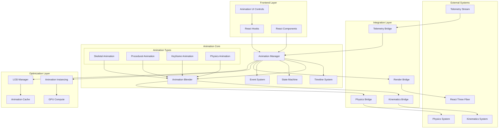
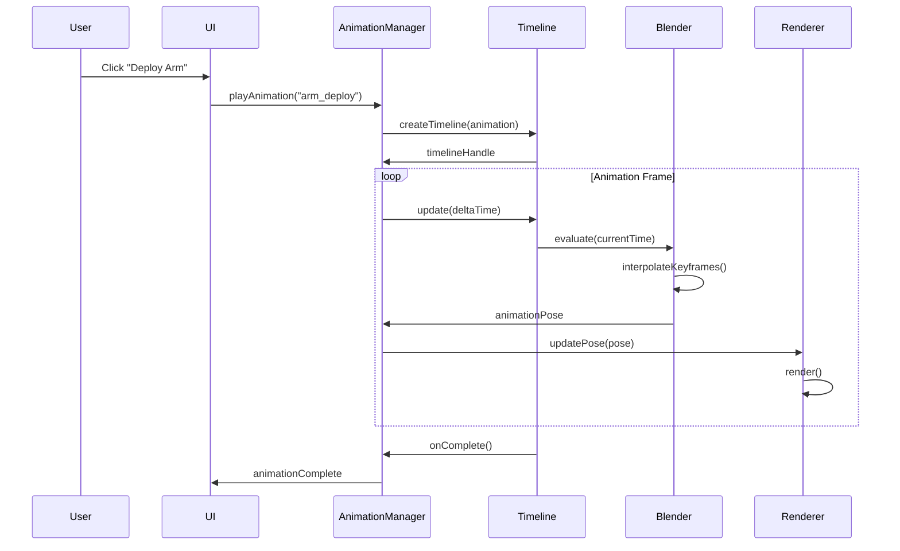
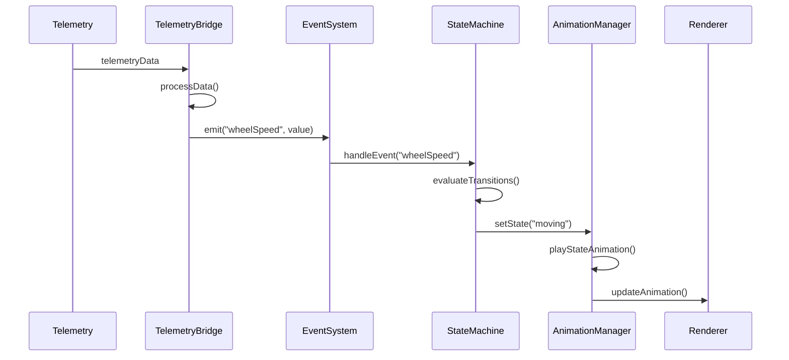
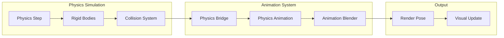
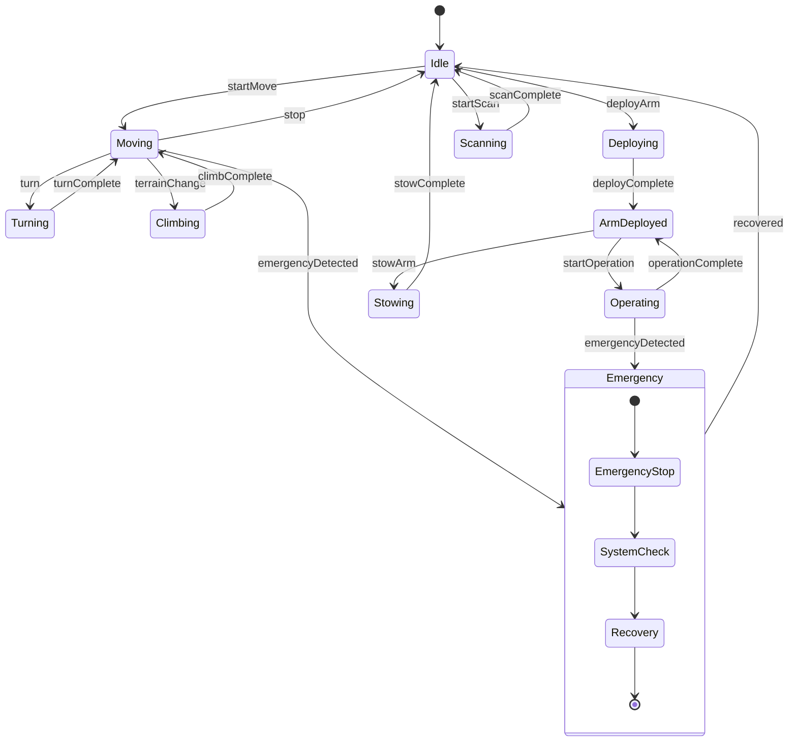
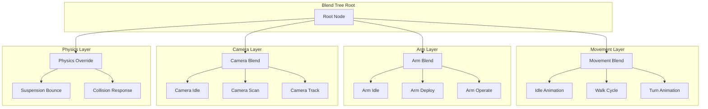
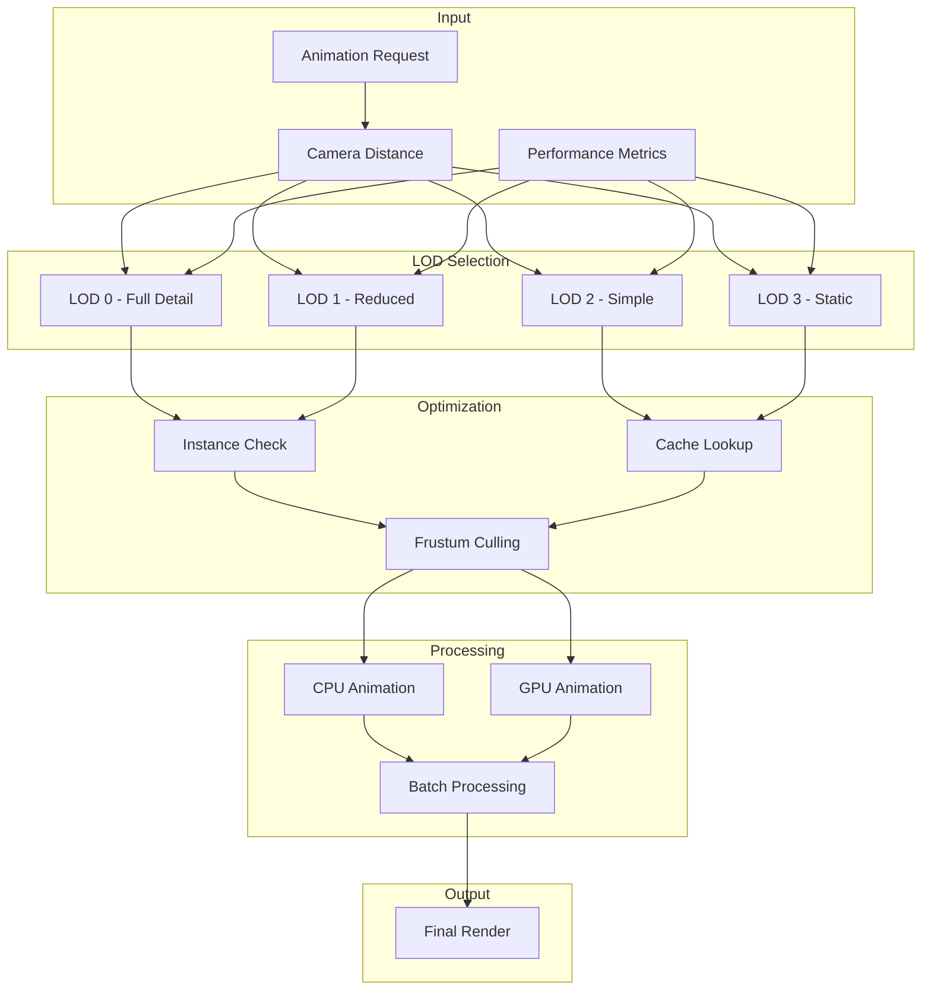
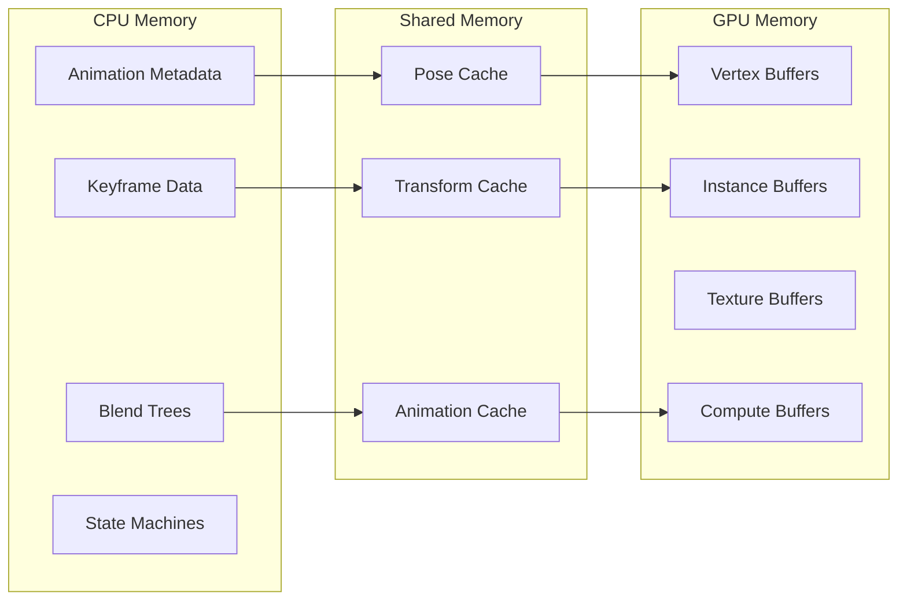
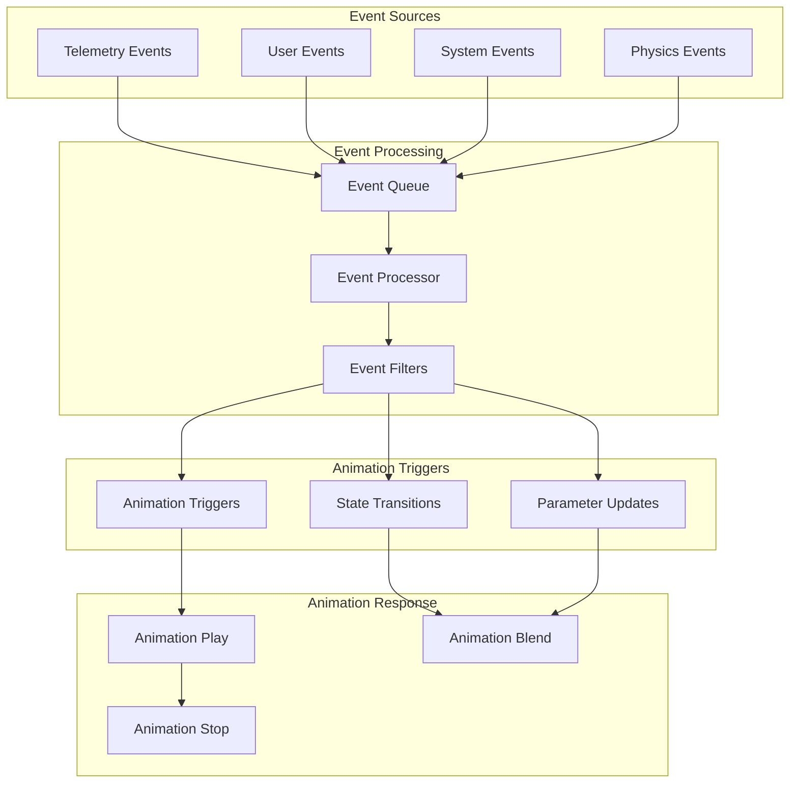
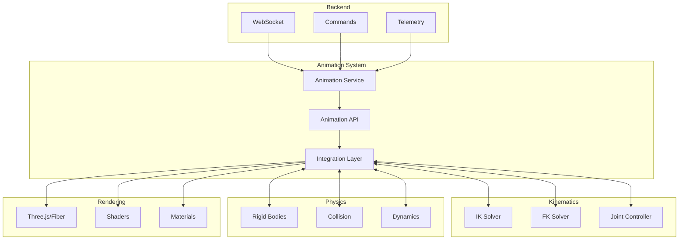

# Animation System Diagrams and Data Flow

## Component Architecture Diagram



## Data Flow Architecture

### 1. Animation Playback Flow



### 2. Telemetry-Driven Animation Flow



### 3. Physics Integration Flow



## Animation State Machine



## Animation Blending Tree



## Performance Optimization Pipeline



## Memory Layout



## Event Flow Diagram



## Integration Points



## Data Structures

### Animation Clip Structure
```typescript
interface AnimationClip {
  id: string;
  name: string;
  duration: number;
  tracks: {
    position: Track<Vector3>;
    rotation: Track<Quaternion>;
    scale: Track<Vector3>;
    morphTargets?: Track<number[]>;
    custom?: Map<string, Track<any>>;
  };
  metadata: {
    fps: number;
    loop: boolean;
    blendMode: 'override' | 'additive' | 'modulate';
    priority: number;
    tags: string[];
  };
}
```

### Animation State Structure
```typescript
interface AnimationState {
  id: string;
  name: string;
  clips: AnimationClip[];
  transitions: Transition[];
  parameters: Parameter[];
  events: StateEvent[];
  layers: {
    base: AnimationLayer;
    additive: AnimationLayer[];
    override: AnimationLayer[];
  };
  blendTree?: BlendTreeNode;
}
```

### Performance Metrics Structure
```typescript
interface AnimationMetrics {
  fps: number;
  frameTime: number;
  activeAnimations: number;
  blendOperations: number;
  cacheHits: number;
  cacheMisses: number;
  gpuTime: number;
  cpuTime: number;
  memoryUsage: {
    cpu: number;
    gpu: number;
    cached: number;
  };
}
```