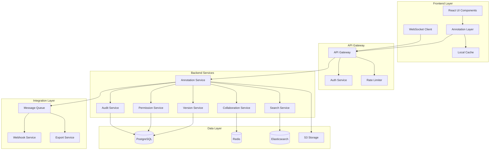

# Enterprise Annotation System Architecture

## Executive Summary

This document presents a comprehensive architecture for an enterprise-grade annotation system for the Rover Mission Control telemetry charts. The system extends the existing basic annotation functionality to include versioning, permissions, audit trails, collaboration features, and advanced search capabilities.

## Table of Contents

1. [System Overview](#system-overview)
2. [Architecture Diagram](#architecture-diagram)
3. [Database Schema](#database-schema)
4. [API Specification](#api-specification)
5. [Security Model](#security-model)
6. [Implementation Components](#implementation-components)
7. [Integration Points](#integration-points)
8. [Performance Considerations](#performance-considerations)
9. [Deployment Strategy](#deployment-strategy)

## System Overview

### Current State
- Basic annotation layer supporting point, line, arrow, rect, and text annotations
- Client-side only implementation
- No persistence or collaboration features
- Limited to single-user, session-based annotations

### Target State
- Enterprise-ready annotation system with full CRUD operations
- Version control with branching and merging capabilities
- Role-based access control (RBAC) with granular permissions
- Real-time collaboration with conflict resolution
- Complete audit trail for compliance
- Advanced search and filtering capabilities
- Integration with external systems via webhooks and APIs

## Architecture Diagram



## Database Schema

### PostgreSQL Schema

```sql
-- Users and Organizations (extends existing auth tables)
CREATE TABLE IF NOT EXISTS organizations (
    id UUID PRIMARY KEY DEFAULT gen_random_uuid(),
    name VARCHAR(255) NOT NULL,
    settings JSONB DEFAULT '{}',
    created_at TIMESTAMP WITH TIME ZONE DEFAULT CURRENT_TIMESTAMP,
    updated_at TIMESTAMP WITH TIME ZONE DEFAULT CURRENT_TIMESTAMP
);

-- Annotation Collections
CREATE TABLE IF NOT EXISTS annotation_collections (
    id UUID PRIMARY KEY DEFAULT gen_random_uuid(),
    name VARCHAR(255) NOT NULL,
    description TEXT,
    organization_id UUID REFERENCES organizations(id),
    created_by UUID REFERENCES users(id),
    settings JSONB DEFAULT '{}',
    created_at TIMESTAMP WITH TIME ZONE DEFAULT CURRENT_TIMESTAMP,
    updated_at TIMESTAMP WITH TIME ZONE DEFAULT CURRENT_TIMESTAMP
);

-- Main Annotations Table
CREATE TABLE IF NOT EXISTS annotations (
    id UUID PRIMARY KEY DEFAULT gen_random_uuid(),
    collection_id UUID REFERENCES annotation_collections(id),
    chart_id VARCHAR(255) NOT NULL,
    type VARCHAR(50) NOT NULL CHECK (type IN ('point', 'line', 'arrow', 'rect', 'text', 'polygon', 'custom')),
    
    -- Positioning data
    coordinates JSONB NOT NULL, -- {x, y, x2, y2, points: [{x,y}], etc.}
    chart_context JSONB NOT NULL, -- {timeRange, valueRange, scale, etc.}
    
    -- Content
    title VARCHAR(500),
    content TEXT,
    metadata JSONB DEFAULT '{}',
    
    -- Styling
    style JSONB DEFAULT '{}',
    
    -- Flags
    is_active BOOLEAN DEFAULT true,
    is_deleted BOOLEAN DEFAULT false,
    
    -- Timestamps
    created_at TIMESTAMP WITH TIME ZONE DEFAULT CURRENT_TIMESTAMP,
    updated_at TIMESTAMP WITH TIME ZONE DEFAULT CURRENT_TIMESTAMP,
    deleted_at TIMESTAMP WITH TIME ZONE,
    
    -- Indexes
    INDEX idx_chart_id (chart_id),
    INDEX idx_collection_id (collection_id),
    INDEX idx_created_at (created_at),
    INDEX idx_is_active (is_active)
);

-- Annotation Versions
CREATE TABLE IF NOT EXISTS annotation_versions (
    id UUID PRIMARY KEY DEFAULT gen_random_uuid(),
    annotation_id UUID REFERENCES annotations(id) ON DELETE CASCADE,
    version_number INTEGER NOT NULL,
    
    -- Version data (complete snapshot)
    data JSONB NOT NULL,
    
    -- Change tracking
    change_type VARCHAR(50) NOT NULL CHECK (change_type IN ('create', 'update', 'delete', 'restore')),
    change_summary TEXT,
    diff JSONB,
    
    -- Version metadata
    created_by UUID REFERENCES users(id),
    created_at TIMESTAMP WITH TIME ZONE DEFAULT CURRENT_TIMESTAMP,
    
    -- Branch support
    branch_name VARCHAR(255) DEFAULT 'main',
    parent_version_id UUID REFERENCES annotation_versions(id),
    is_merged BOOLEAN DEFAULT false,
    merged_at TIMESTAMP WITH TIME ZONE,
    merged_by UUID REFERENCES users(id),
    
    UNIQUE(annotation_id, version_number, branch_name),
    INDEX idx_annotation_versions (annotation_id),
    INDEX idx_branch_name (branch_name)
);

-- Permissions
CREATE TABLE IF NOT EXISTS annotation_permissions (
    id UUID PRIMARY KEY DEFAULT gen_random_uuid(),
    resource_type VARCHAR(50) NOT NULL CHECK (resource_type IN ('collection', 'annotation')),
    resource_id UUID NOT NULL,
    
    -- Permission target (user, group, role)
    target_type VARCHAR(50) NOT NULL CHECK (target_type IN ('user', 'group', 'role', 'organization')),
    target_id UUID NOT NULL,
    
    -- Permissions
    can_read BOOLEAN DEFAULT false,
    can_create BOOLEAN DEFAULT false,
    can_update BOOLEAN DEFAULT false,
    can_delete BOOLEAN DEFAULT false,
    can_approve BOOLEAN DEFAULT false,
    can_share BOOLEAN DEFAULT false,
    
    -- Metadata
    granted_by UUID REFERENCES users(id),
    granted_at TIMESTAMP WITH TIME ZONE DEFAULT CURRENT_TIMESTAMP,
    expires_at TIMESTAMP WITH TIME ZONE,
    
    UNIQUE(resource_type, resource_id, target_type, target_id),
    INDEX idx_resource (resource_type, resource_id),
    INDEX idx_target (target_type, target_id)
);

-- Audit Trail
CREATE TABLE IF NOT EXISTS annotation_audit_log (
    id UUID PRIMARY KEY DEFAULT gen_random_uuid(),
    
    -- What happened
    action VARCHAR(100) NOT NULL,
    resource_type VARCHAR(50) NOT NULL,
    resource_id UUID NOT NULL,
    
    -- Who did it
    user_id UUID REFERENCES users(id),
    user_email VARCHAR(255),
    user_name VARCHAR(255),
    
    -- Context
    ip_address INET,
    user_agent TEXT,
    session_id VARCHAR(255),
    
    -- Details
    old_value JSONB,
    new_value JSONB,
    metadata JSONB DEFAULT '{}',
    
    -- When
    created_at TIMESTAMP WITH TIME ZONE DEFAULT CURRENT_TIMESTAMP,
    
    -- Indexes for querying
    INDEX idx_audit_user (user_id),
    INDEX idx_audit_resource (resource_type, resource_id),
    INDEX idx_audit_action (action),
    INDEX idx_audit_created (created_at)
);

-- Attachments
CREATE TABLE IF NOT EXISTS annotation_attachments (
    id UUID PRIMARY KEY DEFAULT gen_random_uuid(),
    annotation_id UUID REFERENCES annotations(id) ON DELETE CASCADE,
    
    -- File info
    filename VARCHAR(255) NOT NULL,
    content_type VARCHAR(100),
    size_bytes BIGINT,
    storage_key VARCHAR(500) NOT NULL, -- S3 key
    
    -- Metadata
    uploaded_by UUID REFERENCES users(id),
    uploaded_at TIMESTAMP WITH TIME ZONE DEFAULT CURRENT_TIMESTAMP,
    
    INDEX idx_annotation_attachments (annotation_id)
);

-- Comments and Discussions
CREATE TABLE IF NOT EXISTS annotation_comments (
    id UUID PRIMARY KEY DEFAULT gen_random_uuid(),
    annotation_id UUID REFERENCES annotations(id) ON DELETE CASCADE,
    parent_comment_id UUID REFERENCES annotation_comments(id),
    
    -- Content
    content TEXT NOT NULL,
    
    -- Metadata
    created_by UUID REFERENCES users(id),
    created_at TIMESTAMP WITH TIME ZONE DEFAULT CURRENT_TIMESTAMP,
    updated_at TIMESTAMP WITH TIME ZONE DEFAULT CURRENT_TIMESTAMP,
    is_deleted BOOLEAN DEFAULT false,
    
    INDEX idx_annotation_comments (annotation_id),
    INDEX idx_parent_comment (parent_comment_id)
);

-- Tags and Categories
CREATE TABLE IF NOT EXISTS annotation_tags (
    id UUID PRIMARY KEY DEFAULT gen_random_uuid(),
    name VARCHAR(100) NOT NULL,
    color VARCHAR(7),
    organization_id UUID REFERENCES organizations(id),
    
    UNIQUE(name, organization_id)
);

CREATE TABLE IF NOT EXISTS annotation_tag_mappings (
    annotation_id UUID REFERENCES annotations(id) ON DELETE CASCADE,
    tag_id UUID REFERENCES annotation_tags(id) ON DELETE CASCADE,
    
    PRIMARY KEY (annotation_id, tag_id)
);

-- Collaboration Presence
CREATE TABLE IF NOT EXISTS annotation_presence (
    id UUID PRIMARY KEY DEFAULT gen_random_uuid(),
    annotation_id UUID REFERENCES annotations(id) ON DELETE CASCADE,
    user_id UUID REFERENCES users(id),
    
    -- Presence data
    cursor_position JSONB,
    selection JSONB,
    viewport JSONB,
    
    -- Status
    status VARCHAR(50) DEFAULT 'active',
    last_heartbeat TIMESTAMP WITH TIME ZONE DEFAULT CURRENT_TIMESTAMP,
    
    UNIQUE(annotation_id, user_id),
    INDEX idx_presence_heartbeat (last_heartbeat)
);
```

## API Specification

### RESTful API Endpoints

```yaml
openapi: 3.0.0
info:
  title: Annotation System API
  version: 1.0.0

paths:
  /api/v1/annotations:
    get:
      summary: List annotations
      parameters:
        - name: chart_id
          in: query
          schema:
            type: string
        - name: collection_id
          in: query
          schema:
            type: string
        - name: tags
          in: query
          schema:
            type: array
            items:
              type: string
        - name: time_range
          in: query
          schema:
            type: object
            properties:
              start:
                type: string
                format: date-time
              end:
                type: string
                format: date-time
        - name: search
          in: query
          schema:
            type: string
        - name: page
          in: query
          schema:
            type: integer
        - name: limit
          in: query
          schema:
            type: integer
      responses:
        200:
          description: List of annotations
          content:
            application/json:
              schema:
                $ref: '#/components/schemas/AnnotationList'
    
    post:
      summary: Create annotation
      requestBody:
        content:
          application/json:
            schema:
              $ref: '#/components/schemas/AnnotationCreate'
      responses:
        201:
          description: Created annotation
          content:
            application/json:
              schema:
                $ref: '#/components/schemas/Annotation'

  /api/v1/annotations/{id}:
    get:
      summary: Get annotation details
      parameters:
        - name: id
          in: path
          required: true
          schema:
            type: string
        - name: include_versions
          in: query
          schema:
            type: boolean
      responses:
        200:
          description: Annotation details
          content:
            application/json:
              schema:
                $ref: '#/components/schemas/AnnotationDetail'
    
    put:
      summary: Update annotation
      parameters:
        - name: id
          in: path
          required: true
          schema:
            type: string
      requestBody:
        content:
          application/json:
            schema:
              $ref: '#/components/schemas/AnnotationUpdate'
      responses:
        200:
          description: Updated annotation
          content:
            application/json:
              schema:
                $ref: '#/components/schemas/Annotation'
    
    delete:
      summary: Delete annotation
      parameters:
        - name: id
          in: path
          required: true
          schema:
            type: string
      responses:
        204:
          description: Annotation deleted

  /api/v1/annotations/{id}/versions:
    get:
      summary: Get annotation version history
      parameters:
        - name: id
          in: path
          required: true
          schema:
            type: string
        - name: branch
          in: query
          schema:
            type: string
      responses:
        200:
          description: Version history
          content:
            application/json:
              schema:
                $ref: '#/components/schemas/VersionList'

  /api/v1/annotations/{id}/versions/{version_id}/restore:
    post:
      summary: Restore annotation to specific version
      parameters:
        - name: id
          in: path
          required: true
          schema:
            type: string
        - name: version_id
          in: path
          required: true
          schema:
            type: string
      responses:
        200:
          description: Restored annotation
          content:
            application/json:
              schema:
                $ref: '#/components/schemas/Annotation'

  /api/v1/annotations/{id}/permissions:
    get:
      summary: Get annotation permissions
      parameters:
        - name: id
          in: path
          required: true
          schema:
            type: string
      responses:
        200:
          description: Permission list
          content:
            application/json:
              schema:
                $ref: '#/components/schemas/PermissionList'
    
    post:
      summary: Grant permission
      parameters:
        - name: id
          in: path
          required: true
          schema:
            type: string
      requestBody:
        content:
          application/json:
            schema:
              $ref: '#/components/schemas/PermissionGrant'
      responses:
        201:
          description: Permission granted
          content:
            application/json:
              schema:
                $ref: '#/components/schemas/Permission'

  /api/v1/annotations/{id}/comments:
    get:
      summary: Get annotation comments
      parameters:
        - name: id
          in: path
          required: true
          schema:
            type: string
      responses:
        200:
          description: Comment thread
          content:
            application/json:
              schema:
                $ref: '#/components/schemas/CommentList'
    
    post:
      summary: Add comment
      parameters:
        - name: id
          in: path
          required: true
          schema:
            type: string
      requestBody:
        content:
          application/json:
            schema:
              $ref: '#/components/schemas/CommentCreate'
      responses:
        201:
          description: Created comment
          content:
            application/json:
              schema:
                $ref: '#/components/schemas/Comment'

  /api/v1/annotations/search:
    post:
      summary: Advanced search
      requestBody:
        content:
          application/json:
            schema:
              $ref: '#/components/schemas/SearchQuery'
      responses:
        200:
          description: Search results
          content:
            application/json:
              schema:
                $ref: '#/components/schemas/SearchResults'

  /api/v1/annotations/export:
    post:
      summary: Export annotations
      requestBody:
        content:
          application/json:
            schema:
              type: object
              properties:
                format:
                  type: string
                  enum: [pdf, excel, json, csv]
                filters:
                  $ref: '#/components/schemas/ExportFilters'
      responses:
        200:
          description: Export file
          content:
            application/octet-stream:
              schema:
                type: string
                format: binary

components:
  schemas:
    Annotation:
      type: object
      properties:
        id:
          type: string
        type:
          type: string
          enum: [point, line, arrow, rect, text, polygon, custom]
        coordinates:
          type: object
        title:
          type: string
        content:
          type: string
        style:
          type: object
        tags:
          type: array
          items:
            type: string
        created_by:
          $ref: '#/components/schemas/User'
        created_at:
          type: string
          format: date-time
        updated_at:
          type: string
          format: date-time
```

### WebSocket API for Real-time Collaboration

```typescript
interface WebSocketMessage {
  type: 'subscribe' | 'unsubscribe' | 'update' | 'presence' | 'cursor' | 'selection';
  payload: any;
}

// Subscribe to annotation updates
{
  type: 'subscribe',
  payload: {
    chart_id: string;
    collection_id?: string;
  }
}

// Real-time annotation update
{
  type: 'update',
  payload: {
    action: 'create' | 'update' | 'delete';
    annotation: Annotation;
    version_id: string;
    user: User;
  }
}

// Presence update
{
  type: 'presence',
  payload: {
    user_id: string;
    user: User;
    status: 'joined' | 'left' | 'active' | 'idle';
    cursor?: { x: number; y: number };
    selection?: SelectionBounds;
  }
}
```

## Security Model

### Permission Hierarchy

```typescript
enum PermissionLevel {
  NONE = 0,
  READ = 1,
  CREATE = 2,
  UPDATE = 3,
  DELETE = 4,
  APPROVE = 5,
  ADMIN = 6
}

interface PermissionCheck {
  resource_type: 'collection' | 'annotation';
  resource_id: string;
  action: 'read' | 'create' | 'update' | 'delete' | 'approve' | 'share';
  user: User;
}
```

### Role Definitions

```yaml
roles:
  viewer:
    permissions:
      - annotations:read
      - collections:read
  
  contributor:
    inherits: viewer
    permissions:
      - annotations:create
      - annotations:update:own
      - comments:create
  
  reviewer:
    inherits: contributor
    permissions:
      - annotations:update:all
      - annotations:approve
      - versions:restore
  
  admin:
    inherits: reviewer
    permissions:
      - annotations:delete
      - permissions:manage
      - collections:manage
      - audit:read
```

### Security Features

1. **Authentication**: JWT tokens with RS256 signing
2. **Authorization**: RBAC with attribute-based access control (ABAC)
3. **Encryption**: TLS 1.3 for transport, AES-256-GCM for storage
4. **Audit Logging**: Complete audit trail with tamper detection
5. **Data Isolation**: Multi-tenant architecture with row-level security
6. **Input Validation**: Schema validation on all inputs
7. **Rate Limiting**: Per-user and per-IP rate limiting

## Implementation Components

### Backend Services

#### 1. Annotation Service
```typescript
class AnnotationService {
  // Core CRUD operations
  async createAnnotation(data: AnnotationCreate): Promise<Annotation>
  async updateAnnotation(id: string, data: AnnotationUpdate): Promise<Annotation>
  async deleteAnnotation(id: string): Promise<void>
  async getAnnotation(id: string): Promise<Annotation>
  async listAnnotations(filters: AnnotationFilters): Promise<PaginatedList<Annotation>>
  
  // Bulk operations
  async bulkCreate(annotations: AnnotationCreate[]): Promise<Annotation[]>
  async bulkUpdate(updates: AnnotationBulkUpdate[]): Promise<Annotation[]>
  async bulkDelete(ids: string[]): Promise<void>
}
```

#### 2. Version Service
```typescript
class VersionService {
  async createVersion(annotation: Annotation, changeType: ChangeType): Promise<Version>
  async getVersionHistory(annotationId: string): Promise<Version[]>
  async getVersionDiff(versionId1: string, versionId2: string): Promise<Diff>
  async restoreVersion(annotationId: string, versionId: string): Promise<Annotation>
  async createBranch(annotationId: string, branchName: string): Promise<Branch>
  async mergeBranch(annotationId: string, sourceBranch: string, targetBranch: string): Promise<MergeResult>
}
```

#### 3. Permission Service
```typescript
class PermissionService {
  async checkPermission(check: PermissionCheck): Promise<boolean>
  async grantPermission(grant: PermissionGrant): Promise<Permission>
  async revokePermission(permissionId: string): Promise<void>
  async listPermissions(resourceType: string, resourceId: string): Promise<Permission[]>
  async getEffectivePermissions(userId: string, resourceType: string, resourceId: string): Promise<EffectivePermissions>
}
```

#### 4. Audit Service
```typescript
class AuditService {
  async logAction(action: AuditAction): Promise<void>
  async queryAuditLog(filters: AuditFilters): Promise<PaginatedList<AuditEntry>>
  async generateAuditReport(dateRange: DateRange): Promise<AuditReport>
  async verifyAuditIntegrity(entryId: string): Promise<IntegrityCheck>
}
```

#### 5. Search Service
```typescript
class SearchService {
  async indexAnnotation(annotation: Annotation): Promise<void>
  async searchAnnotations(query: SearchQuery): Promise<SearchResults>
  async suggestAnnotations(context: ChartContext): Promise<Annotation[]>
  async rebuildIndex(): Promise<void>
}
```

#### 6. Collaboration Service
```typescript
class CollaborationService {
  async joinSession(userId: string, chartId: string): Promise<void>
  async updatePresence(userId: string, presence: PresenceUpdate): Promise<void>
  async broadcastUpdate(chartId: string, update: AnnotationUpdate): Promise<void>
  async resolveConflict(conflict: ConflictData): Promise<Resolution>
}
```

### Frontend Components

#### 1. Enhanced Annotation Layer
```typescript
interface EnhancedAnnotationLayerProps {
  // Existing props
  svg: SVGSVGElement;
  container: SVGGElement;
  annotations: Annotation[];
  scales: ChartScales;
  dimensions: ChartDimensions;
  
  // New enterprise props
  permissions: UserPermissions;
  collaborators: Collaborator[];
  onVersionCreate: (annotation: Annotation) => void;
  onPermissionChange: (annotation: Annotation, permissions: Permission[]) => void;
  onCommentAdd: (annotation: Annotation, comment: string) => void;
  onBranchCreate: (annotation: Annotation, branchName: string) => void;
}
```

#### 2. Annotation Manager Component
```typescript
interface AnnotationManagerProps {
  chartId: string;
  collectionId?: string;
  user: User;
  permissions: UserPermissions;
  onAnnotationSelect: (annotation: Annotation) => void;
}

const AnnotationManager: React.FC<AnnotationManagerProps> = (props) => {
  // Version history panel
  // Permission management UI
  // Search and filter interface
  // Bulk operations toolbar
  // Export functionality
}
```

#### 3. Collaboration Overlay
```typescript
interface CollaborationOverlayProps {
  collaborators: Collaborator[];
  annotations: Annotation[];
  onCursorMove: (position: CursorPosition) => void;
  onSelectionChange: (selection: Selection) => void;
}

const CollaborationOverlay: React.FC<CollaborationOverlayProps> = (props) => {
  // Render other users' cursors
  // Show active selections
  // Display presence indicators
  // Handle real-time updates
}
```

## Integration Points

### 1. Webhook Integration
```typescript
interface WebhookConfig {
  url: string;
  events: string[];
  secret: string;
  headers?: Record<string, string>;
}

interface WebhookPayload {
  event: string;
  timestamp: string;
  data: {
    annotation: Annotation;
    user: User;
    changes?: any;
  };
  signature: string;
}
```

### 2. Export Service Integration
```typescript
class ExportService {
  async exportToPDF(annotations: Annotation[], options: PDFOptions): Promise<Buffer>
  async exportToExcel(annotations: Annotation[], options: ExcelOptions): Promise<Buffer>
  async exportToJSON(annotations: Annotation[]): Promise<string>
  async scheduleExport(schedule: ExportSchedule): Promise<void>
}
```

### 3. Alerting System Integration
```typescript
interface AlertRule {
  id: string;
  name: string;
  condition: {
    annotation_pattern: string;
    threshold?: number;
    keywords?: string[];
  };
  actions: AlertAction[];
}

interface AlertAction {
  type: 'email' | 'slack' | 'webhook' | 'pagerduty';
  config: any;
}
```

### 4. External API Integration
```typescript
// Public API for third-party tools
interface PublicAPI {
  // OAuth 2.0 authentication
  authenticate(clientId: string, clientSecret: string): Promise<AccessToken>
  
  // Annotation operations
  createAnnotation(token: string, annotation: AnnotationCreate): Promise<Annotation>
  queryAnnotations(token: string, query: Query): Promise<Annotation[]>
  subscribeToUpdates(token: string, callback: UpdateCallback): Subscription
}
```

## Performance Considerations

### 1. Caching Strategy
```typescript
interface CacheConfig {
  // Redis cache for frequently accessed data
  annotation_ttl: 3600; // 1 hour
  permission_ttl: 1800; // 30 minutes
  search_result_ttl: 300; // 5 minutes
  
  // Local cache for real-time data
  presence_ttl: 30; // 30 seconds
  cursor_ttl: 5; // 5 seconds
}
```

### 2. Database Optimization
- Indexes on frequently queried fields
- Partitioning for audit logs by date
- Read replicas for search queries
- Connection pooling
- Query optimization with EXPLAIN ANALYZE

### 3. Real-time Performance
- WebSocket connection pooling
- Message batching for updates
- Debouncing for cursor movements
- Efficient diff algorithms
- Binary protocols for high-frequency updates

### 4. Storage Optimization
- Compression for historical versions
- Delta storage for version diffs
- S3 lifecycle policies for attachments
- CDN for static assets
- Progressive loading for large annotation sets

## Deployment Strategy

### 1. Infrastructure Requirements
```yaml
services:
  annotation-api:
    replicas: 3
    resources:
      cpu: 2
      memory: 4Gi
    autoscaling:
      min: 3
      max: 10
      target_cpu: 70%
  
  postgres:
    version: 15
    instance_type: db.r6g.xlarge
    storage: 500Gi
    backup:
      retention: 30d
      schedule: "0 2 * * *"
  
  redis:
    version: 7
    instance_type: cache.r6g.large
    cluster_mode: enabled
    nodes: 3
  
  elasticsearch:
    version: 8
    instance_type: r6g.xlarge.elasticsearch
    nodes: 3
    storage: 100Gi
```

### 2. Monitoring and Observability
```typescript
interface Metrics {
  // Business metrics
  annotations_created_per_minute: Counter;
  active_collaborators: Gauge;
  search_queries_per_second: Counter;
  
  // Performance metrics
  api_latency_p99: Histogram;
  websocket_connections: Gauge;
  cache_hit_rate: Gauge;
  
  // Error metrics
  permission_denied_rate: Counter;
  version_conflict_rate: Counter;
  api_error_rate: Counter;
}
```

### 3. Deployment Pipeline
```yaml
stages:
  - test:
      - unit_tests
      - integration_tests
      - security_scan
      - performance_tests
  
  - build:
      - docker_build
      - vulnerability_scan
      - artifact_upload
  
  - deploy:
      - staging:
          - database_migration
          - canary_deployment
          - smoke_tests
      - production:
          - blue_green_deployment
          - health_checks
          - rollback_ready
```

## Migration Strategy

### Phase 1: Backend Infrastructure (Week 1-2)
1. Set up PostgreSQL schema
2. Implement core services
3. Create API endpoints
4. Set up Redis and Elasticsearch

### Phase 2: Basic Integration (Week 3-4)
1. Update frontend annotation layer
2. Implement authentication flow
3. Add basic CRUD operations
4. Deploy to staging

### Phase 3: Advanced Features (Week 5-6)
1. Implement versioning system
2. Add collaboration features
3. Build search functionality
4. Integrate audit logging

### Phase 4: Enterprise Features (Week 7-8)
1. Complete permission system
2. Add webhook support
3. Implement export functionality
4. Performance optimization

### Phase 5: Production Rollout (Week 9-10)
1. User training
2. Data migration
3. Gradual rollout
4. Monitor and optimize

## Risk Mitigation

1. **Data Loss**: Regular backups, version history, soft deletes
2. **Performance**: Caching, pagination, progressive loading
3. **Security**: Encryption, audit trails, permission checks
4. **Conflicts**: Optimistic locking, merge strategies
5. **Scalability**: Horizontal scaling, message queuing
6. **Compliance**: Audit logs, data retention policies

## Conclusion

This architecture provides a robust, scalable, and secure foundation for an enterprise annotation system. It extends the current basic functionality with comprehensive features for collaboration, versioning, permissions, and integration while maintaining performance and reliability standards suitable for mission-critical rover operations.