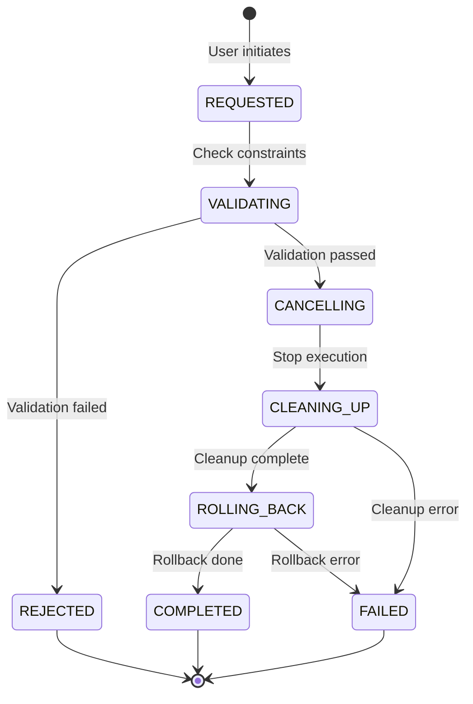

# Command Cancellation and Rollback Guide

## Overview

The Rover Mission Control system provides comprehensive command cancellation and rollback capabilities to ensure safe operation and system consistency. This guide covers the implementation details, safety features, and usage patterns.

## Architecture

### Backend Components

1. **CancellationManager** (`backend/command_queue/cancellation_manager.py`)
   - Coordinates the cancellation lifecycle
   - Validates safety constraints
   - Manages resource cleanup
   - Executes compensating actions

2. **CompensatingCommands Framework** (`backend/command_queue/compensating_commands.py`)
   - Implements the Compensating Transaction pattern
   - Provides strategies for undoing command effects
   - Captures system state for restoration

3. **Cancellation API** (`backend/command_queue/cancellation_api.py`)
   - REST endpoints for cancellation operations
   - Permission-based access control
   - Batch cancellation support

### Frontend Components

1. **CancellationService** (`frontend/src/services/cancellationService.ts`)
   - TypeScript client for cancellation API
   - WebSocket integration for real-time updates
   - Automatic retry and error handling

2. **React Components**
   - `CommandCancellationDialog`: User interface for cancellation
   - `CommandCancellationStatus`: Real-time status display
   - `RollbackVisualization`: Visual representation of rollback

3. **React Hook** (`frontend/src/hooks/useCommandCancellation.ts`)
   - Simplified cancellation management
   - Automatic event subscription
   - State management

## Safety Features

### Non-Cancellable Commands

Certain commands are marked as non-cancellable for safety:
- `EMERGENCY_STOP`: Critical safety command
- `FIRMWARE_UPDATE`: System integrity
- `RESET`: System state command

These can only be cancelled with the `force` flag and admin permissions.

### Confirmation Requirements

Critical commands require explicit confirmation:
```typescript
// The user must type the exact confirmation text
confirmationText: "CANCEL-FIRMWARE_UPDATE"
```

### Resource Cleanup

The system ensures proper resource cleanup:
1. Hardware locks are released
2. Network connections are closed
3. Memory buffers are freed
4. State is restored to safe defaults

### Audit Trail

All cancellation actions are logged:
- Who requested cancellation
- When it was requested
- Why it was cancelled
- What cleanup actions were taken
- Success or failure status

## Cancellation Lifecycle



## Usage Examples

### Backend Usage

#### Basic Cancellation
```python
from backend.command_queue.cancellation_manager import CancellationRequest, CancellationReason

# Create cancellation request
request = CancellationRequest(
    command_id="cmd-123",
    reason=CancellationReason.USER_REQUEST,
    requester_id=current_user.id,
    rollback_requested=True
)

# Execute cancellation
success, error = await cancellation_manager.request_cancellation(request)
```

#### Registering Cleanup Handlers
```python
from backend.command_queue.cancellation_manager import ResourceCleanupHandler

async def cleanup_hardware_locks(command):
    """Release hardware resources"""
    await hardware_controller.release_locks(command.id)

# Register handler
cancellation_manager.register_cleanup_handler(
    ResourceCleanupHandler(
        resource_type="hardware_locks",
        handler=cleanup_hardware_locks,
        priority=100,  # Higher priority = runs first
        critical=True  # Failure blocks cancellation
    )
)
```

#### Registering Compensating Actions
```python
from backend.command_queue.compensating_commands import CompensatingAction

async def compensate_movement(command, metadata):
    """Move back to original position"""
    distance = command.parameters.get("distance", 0)
    await rover.move_backward(distance)

# Register compensating action
cancellation_manager.register_compensating_action(
    CommandType.MOVE_FORWARD,
    CompensatingAction(
        action_type="reverse_movement",
        execute=compensate_movement
    )
)
```

### Frontend Usage

#### Using the Cancellation Hook
```typescript
import { useCommandCancellation } from '@/hooks/useCommandCancellation';

function CommandControl({ commandId }) {
  const {
    cancellationStatus,
    isInProgress,
    cancelCommand,
    error
  } = useCommandCancellation(commandId);

  const handleCancel = async () => {
    const success = await cancelCommand(commandId, {
      reason: CancellationReason.USER_REQUEST,
      rollback: true
    });
    
    if (success) {
      console.log('Command cancelled successfully');
    }
  };

  return (
    <div>
      {isInProgress && <CircularProgress />}
      <Button onClick={handleCancel} disabled={!canCancel}>
        Cancel Command
      </Button>
      {error && <Alert severity="error">{error}</Alert>}
    </div>
  );
}
```

#### Using the Cancellation Dialog
```typescript
import { CommandCancellationDialog } from '@/components/command/CommandCancellationDialog';

function CommandList() {
  const [cancellingCommand, setCancellingCommand] = useState(null);

  return (
    <>
      {commands.map(cmd => (
        <ListItem key={cmd.id}>
          <ListItemText primary={cmd.type} />
          <IconButton onClick={() => setCancellingCommand(cmd)}>
            <CancelIcon />
          </IconButton>
        </ListItem>
      ))}
      
      <CommandCancellationDialog
        open={!!cancellingCommand}
        commandId={cancellingCommand?.id}
        commandType={cancellingCommand?.type}
        commandStatus={cancellingCommand?.status}
        onClose={() => setCancellingCommand(null)}
        onCancelled={(success) => {
          if (success) {
            refreshCommands();
          }
          setCancellingCommand(null);
        }}
      />
    </>
  );
}
```

#### Subscribing to Cancellation Events
```typescript
import { getCancellationService } from '@/services/cancellationService';

// Subscribe to events for a specific command
const unsubscribe = cancellationService.subscribeToCancellationEvents(
  commandId,
  (event) => {
    console.log(`Cancellation state: ${event.cancellationState}`);
    
    if (event.cancellationState === CancellationState.COMPLETED) {
      console.log('Cancellation completed successfully');
    }
  }
);

// Clean up when done
unsubscribe();
```

## API Reference

### REST Endpoints

#### Cancel Command
```http
POST /api/commands/cancel
Content-Type: application/json
Authorization: Bearer <token>

{
  "command_id": "cmd-123",
  "reason": "user_request",
  "force": false,
  "rollback": true,
  "notes": "User changed their mind"
}
```

#### Get Active Cancellations
```http
GET /api/commands/cancel/active
Authorization: Bearer <token>
```

#### Get Cancellation History
```http
GET /api/commands/cancel/history?command_id=cmd-123&limit=50
Authorization: Bearer <token>
```

### WebSocket Events

The system emits real-time events for cancellation progress:

```javascript
socket.on('command_event', (event) => {
  if (event.event_type === 'cancellation_started') {
    // Cancellation has begun
  } else if (event.event_type === 'cancellation_completed') {
    // Cancellation finished successfully
  } else if (event.event_type === 'cancellation_failed') {
    // Cancellation failed
  }
});
```

## Best Practices

1. **Always provide a reason** for cancellation to maintain audit trail
2. **Use appropriate timeouts** for cleanup handlers
3. **Test compensating actions** thoroughly before deployment
4. **Monitor cancellation metrics** to identify patterns
5. **Document non-cancellable commands** clearly in UI
6. **Implement proper error handling** for failed cancellations
7. **Use the force flag sparingly** and only with proper authorization

## Testing

The system includes comprehensive test coverage:

```bash
# Run cancellation tests
pytest backend/command_queue/tests/test_cancellation_manager.py -v

# Run frontend tests
npm test -- --testPathPattern=cancellation
```

## Troubleshooting

### Common Issues

1. **"Command already cancelled"**
   - Check if another user cancelled the command
   - Verify command status before attempting cancellation

2. **"Resource cleanup failed"**
   - Check hardware connections
   - Verify cleanup handler implementation
   - Review logs for specific errors

3. **"Confirmation required"**
   - Ensure confirmation text matches exactly
   - Check for expired confirmation tokens

### Debug Mode

Enable debug logging for detailed cancellation information:

```python
import logging
logging.getLogger('backend.command_queue.cancellation_manager').setLevel(logging.DEBUG)
```

## Performance Considerations

- Cancellation typically completes in < 500ms for simple commands
- Complex rollbacks may take several seconds
- Resource cleanup is parallelized where possible
- WebSocket events provide real-time feedback to avoid UI blocking

## Security Considerations

- Cancellation requests are authenticated and authorized
- Audit logs cannot be modified or deleted
- Force cancellation requires admin privileges
- Confirmation tokens expire after 5 minutes
- All cancellation reasons are validated against enum