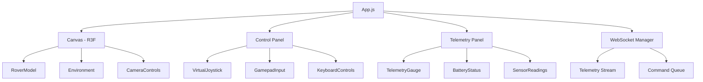

# Frontend Architecture

## Overview
React 19-based single-page application with real-time 3D visualization and control interface for rover operations.

## Directory Structure
```
frontend/
├── src/
│   ├── components/           # React components (to be created)
│   │   ├── 3d/             # 3D visualization components
│   │   │   ├── RoverModel.jsx
│   │   │   ├── Environment.jsx
│   │   │   └── CameraControls.jsx
│   │   ├── controls/       # Control interface components
│   │   │   ├── VirtualJoystick.jsx
│   │   │   ├── GamepadInput.jsx
│   │   │   └── KeyboardControls.jsx
│   │   ├── telemetry/      # Data visualization
│   │   │   ├── TelemetryGauge.jsx
│   │   │   ├── BatteryStatus.jsx
│   │   │   └── SensorReadings.jsx
│   │   └── ui/             # UI components
│   │       ├── Panel.jsx
│   │       ├── ErrorBoundary.jsx
│   │       └── LoadingScreen.jsx
│   ├── hooks/               # Custom React hooks
│   │   ├── useWebSocket.js
│   │   ├── useGamepad.js
│   │   ├── useKeyboard.js
│   │   └── useTelemetry.js
│   ├── services/           # API and WebSocket services
│   │   ├── api.js
│   │   ├── websocket.js
│   │   └── auth.js
│   ├── utils/              # Utility functions
│   │   ├── constants.js
│   │   ├── helpers.js
│   │   └── validators.js
│   ├── assets/             # Static assets
│   │   ├── models/
│   │   ├── textures/
│   │   └── sounds/
│   ├── App.js              # Main application component
│   ├── App.css             # Application styles
│   ├── index.js            # React entry point
│   └── index.css           # Global styles
├── public/
│   ├── index.html          # HTML template
│   └── manifest.json       # PWA manifest
├── package.json            # Dependencies and scripts
├── yarn.lock               # Locked dependencies
├── craco.config.js         # Build configuration overrides
├── tailwind.config.js      # Tailwind CSS configuration
├── postcss.config.js       # PostCSS configuration
└── .env.example            # Environment variables template
```

## Core Components (App.js)

### Main App Component
- Manages global application state
- Handles WebSocket connection lifecycle
- Coordinates between control inputs and visualization

### Component Architecture



### Core Components Implementation

#### RoverModel (3D Visualization)
```jsx
import React, { useRef, useMemo } from 'react'
import { useFrame } from '@react-three/fiber'
import { useGLTF } from '@react-three/drei'
import * as THREE from 'three'

// Pre-allocate vectors for performance
const tempVec = new THREE.Vector3()
const tempQuat = new THREE.Quaternion()

export function RoverModel({ position, rotation, wheelSpeeds }) {
  const groupRef = useRef()
  const wheelRefs = useRef([])
  
  // Load optimized GLTF model
  const { nodes, materials } = useGLTF('/models/rover-optimized.glb')
  
  // Memoize geometry and materials for reuse
  const wheelGeometry = useMemo(() => nodes.wheel.geometry, [nodes])
  const chassisMaterial = useMemo(() => materials.chassis, [materials])
  
  // Efficient animation loop
  useFrame((state, delta) => {
    if (!groupRef.current) return
    
    // Smooth position interpolation
    groupRef.current.position.lerp(
      tempVec.set(position.x, position.y, position.z),
      0.1
    )
    
    // Smooth rotation
    groupRef.current.quaternion.slerp(
      tempQuat.setFromEuler(
        new THREE.Euler(rotation.pitch, rotation.yaw, rotation.roll)
      ),
      0.1
    )
    
    // Animate wheels
    wheelRefs.current.forEach((wheel, index) => {
      if (wheel) {
        wheel.rotation.x += wheelSpeeds[index] * delta
      }
    })
  })
  
  return (
    <group ref={groupRef} dispose={null}>
      <mesh geometry={nodes.chassis.geometry} material={chassisMaterial}>
        {/* Main rover body */}
      </mesh>
      
      {/* Wheels with instanced rendering for performance */}
      <instancedMesh args={[wheelGeometry, materials.wheel, 4]}>
        {/* Wheel instances */}
      </instancedMesh>
      
      {/* Level of Detail (LOD) for distance-based quality */}
      <Detailed distances={[0, 10, 20]}>
        <mesh geometry={nodes.highDetail.geometry} />
        <mesh geometry={nodes.midDetail.geometry} />
        <mesh geometry={nodes.lowDetail.geometry} />
      </Detailed>
    </group>
  )
}

// Pre-load model for faster initial render
useGLTF.preload('/models/rover-optimized.glb')
```

#### TelemetryGauge (Data Visualization)
```jsx
import React, { useRef, useEffect } from 'react'
import { Chart, registerables } from 'chart.js'
import { useSpring, animated } from '@react-spring/web'

Chart.register(...registerables)

export function TelemetryGauge({ 
  value, 
  min = 0, 
  max = 100, 
  label, 
  unit = '', 
  criticalThreshold = 80 
}) {
  const canvasRef = useRef(null)
  const chartRef = useRef(null)
  
  // Smooth value transitions
  const { animatedValue } = useSpring({
    animatedValue: value,
    config: { tension: 300, friction: 30 }
  })
  
  useEffect(() => {
    if (!canvasRef.current) return
    
    const ctx = canvasRef.current.getContext('2d')
    
    // Create gradient for gauge
    const gradient = ctx.createLinearGradient(0, 0, 0, 200)
    gradient.addColorStop(0, '#4ade80')
    gradient.addColorStop(0.5, '#facc15')
    gradient.addColorStop(1, '#ef4444')
    
    if (!chartRef.current) {
      chartRef.current = new Chart(ctx, {
        type: 'doughnut',
        data: {
          datasets: [{
            data: [value, max - value],
            backgroundColor: [gradient, '#1f2937'],
            borderWidth: 0
          }]
        },
        options: {
          responsive: true,
          maintainAspectRatio: false,
          cutout: '75%',
          plugins: {
            legend: { display: false },
            tooltip: { enabled: false }
          }
        }
      })
    } else {
      // Update existing chart
      chartRef.current.data.datasets[0].data = [value, max - value]
      chartRef.current.update('active')
    }
    
    return () => {
      if (chartRef.current) {
        chartRef.current.destroy()
        chartRef.current = null
      }
    }
  }, [value, max])
  
  return (
    <div className="relative w-48 h-48">
      <canvas ref={canvasRef} className="w-full h-full" />
      <div className="absolute inset-0 flex flex-col items-center justify-center">
        <animated.div className="text-3xl font-bold text-white">
          {animatedValue.to(v => v.toFixed(1))}
        </animated.div>
        <div className="text-sm text-gray-400">{unit}</div>
        <div className="text-xs text-gray-500 mt-1">{label}</div>
      </div>
      {value >= criticalThreshold && (
        <div className="absolute top-0 right-0 w-3 h-3 bg-red-500 rounded-full animate-pulse" />
      )}
    </div>
  )
}
```

#### Panel
- Reusable container component
- Consistent styling across UI sections
- Responsive layout support

### Control Implementation

#### Virtual Joystick
```jsx
import React, { useRef, useState, useCallback } from 'react'
import { useSpring, animated } from '@react-spring/web'

export function VirtualJoystick({ onMove, size = 200 }) {
  const containerRef = useRef(null)
  const [isDragging, setIsDragging] = useState(false)
  const [position, setPosition] = useState({ x: 0, y: 0 })
  
  const springProps = useSpring({
    x: isDragging ? position.x : 0,
    y: isDragging ? position.y : 0,
    config: { tension: 300, friction: 30 }
  })
  
  const handleStart = useCallback((e) => {
    setIsDragging(true)
    updatePosition(e)
  }, [])
  
  const handleMove = useCallback((e) => {
    if (!isDragging) return
    updatePosition(e)
  }, [isDragging])
  
  const handleEnd = useCallback(() => {
    setIsDragging(false)
    setPosition({ x: 0, y: 0 })
    onMove({ forward: 0, turn: 0 })
  }, [onMove])
  
  const updatePosition = useCallback((e) => {
    if (!containerRef.current) return
    
    const rect = containerRef.current.getBoundingClientRect()
    const centerX = rect.width / 2
    const centerY = rect.height / 2
    
    const x = (e.clientX - rect.left - centerX) / centerX
    const y = (centerY - (e.clientY - rect.top)) / centerY
    
    // Clamp to circle
    const distance = Math.sqrt(x * x + y * y)
    const clampedDistance = Math.min(distance, 1)
    const angle = Math.atan2(y, x)
    
    const clampedX = Math.cos(angle) * clampedDistance
    const clampedY = Math.sin(angle) * clampedDistance
    
    setPosition({ x: clampedX * centerX, y: -clampedY * centerY })
    onMove({ forward: clampedY, turn: clampedX })
  }, [onMove])
  
  return (
    <div
      ref={containerRef}
      className="relative bg-gray-800 rounded-full cursor-grab active:cursor-grabbing"
      style={{ width: size, height: size }}
      onMouseDown={handleStart}
      onMouseMove={handleMove}
      onMouseUp={handleEnd}
      onMouseLeave={handleEnd}
      onTouchStart={(e) => handleStart(e.touches[0])}
      onTouchMove={(e) => handleMove(e.touches[0])}
      onTouchEnd={handleEnd}
    >
      {/* Background circles */}
      <div className="absolute inset-4 border-2 border-gray-700 rounded-full" />
      <div className="absolute inset-8 border-2 border-gray-700 rounded-full" />
      
      {/* Joystick knob */}
      <animated.div
        className="absolute w-16 h-16 bg-blue-500 rounded-full shadow-lg"
        style={{
          left: '50%',
          top: '50%',
          transform: springProps.x.to(x => 
            springProps.y.to(y => 
              `translate(calc(-50% + ${x}px), calc(-50% + ${y}px))`
            )
          )
        }}
      />
    </div>
  )
}
```

#### Gamepad Integration
```jsx
import { useEffect, useRef, useCallback } from 'react'

export function useGamepad(onControl) {
  const animationFrameRef = useRef()
  const lastUpdateRef = useRef(0)
  
  const handleGamepadInput = useCallback(() => {
    const gamepads = navigator.getGamepads()
    const gamepad = gamepads[0] // Primary controller
    
    if (gamepad && gamepad.connected) {
      // Left stick for movement
      const leftX = gamepad.axes[0]
      const leftY = -gamepad.axes[1] // Invert Y
      
      // Dead zone
      const deadZone = 0.1
      const forward = Math.abs(leftY) > deadZone ? leftY : 0
      const turn = Math.abs(leftX) > deadZone ? leftX : 0
      
      // Throttle updates to 60fps
      const now = performance.now()
      if (now - lastUpdateRef.current > 16.67) {
        onControl({ forward, turn })
        lastUpdateRef.current = now
      }
      
      // Button mappings
      if (gamepad.buttons[0].pressed) { // A button
        onControl({ action: 'boost' })
      }
      if (gamepad.buttons[1].pressed) { // B button
        onControl({ action: 'brake' })
      }
    }
    
    animationFrameRef.current = requestAnimationFrame(handleGamepadInput)
  }, [onControl])
  
  useEffect(() => {
    // Start polling when gamepad connects
    const handleConnect = () => {
      console.log('Gamepad connected')
      handleGamepadInput()
    }
    
    const handleDisconnect = () => {
      console.log('Gamepad disconnected')
      if (animationFrameRef.current) {
        cancelAnimationFrame(animationFrameRef.current)
      }
    }
    
    window.addEventListener('gamepadconnected', handleConnect)
    window.addEventListener('gamepaddisconnected', handleDisconnect)
    
    // Check if already connected
    if (navigator.getGamepads()[0]) {
      handleConnect()
    }
    
    return () => {
      window.removeEventListener('gamepadconnected', handleConnect)
      window.removeEventListener('gamepaddisconnected', handleDisconnect)
      if (animationFrameRef.current) {
        cancelAnimationFrame(animationFrameRef.current)
      }
    }
  }, [handleGamepadInput])
}
```

## Key Dependencies

### UI Framework
- **React 19.0.0**: Latest React with concurrent features
- **React DOM 19.0.0**: DOM rendering
- **React Router DOM 7.5.1**: Navigation (prepared for multi-page)

### 3D Visualization
- **Three.js 0.178.0**: 3D graphics engine
- **@react-three/fiber 6.0.13**: React renderer for Three.js
- **@react-three/drei 10.5.1**: Helper components
- **@react-three/cannon 6.6.0**: Physics engine integration

### UI Components
- **@dnd-kit**: Drag and drop functionality
  - Core, modifiers, sortable, utilities
- **Chart.js 4.5.0**: Data visualization
- **react-chartjs-2 5.3.0**: React wrapper for Chart.js
- **@monaco-editor/react 4.7.0**: Code editor

### Styling
- **Tailwind CSS 3.4.17**: Utility-first CSS
- **PostCSS**: CSS processing
- **Autoprefixer**: Browser compatibility

### HTTP & Real-time
- **Axios 1.8.4**: HTTP client for API calls
- **WebSocket**: Built-in browser API for real-time

## Build Configuration

### CRACO (craco.config.js)
- Webpack alias: `@` → `src/`
- Hot reload control via environment variable
- Watch options for development

### Scripts
```bash
# Development
yarn start        # Starts dev server with hot reload

# Production
yarn build        # Creates optimized build

# Testing  
yarn test         # Runs test suite

# Ejecting (not recommended)
yarn eject        # Ejects from Create React App
```

## State Management
- React hooks for local state
- No global state management library
- WebSocket connection managed in App component
- Telemetry data flows down via props

## Real-time Communication

### WebSocket Manager
```javascript
import { EventEmitter } from 'events'

class WebSocketManager extends EventEmitter {
  constructor(url, options = {}) {
    super()
    this.url = url
    this.options = {
      reconnectInterval: 5000,
      maxReconnectAttempts: 10,
      heartbeatInterval: 5000,
      ...options
    }
    this.ws = null
    this.reconnectAttempts = 0
    this.messageQueue = []
    this.isConnected = false
  }
  
  connect() {
    try {
      // Add authentication token
      const token = localStorage.getItem('auth_token')
      const wsUrl = `${this.url}?token=${token}`
      
      this.ws = new WebSocket(wsUrl)
      this.setupEventHandlers()
    } catch (error) {
      console.error('WebSocket connection error:', error)
      this.scheduleReconnect()
    }
  }
  
  setupEventHandlers() {
    this.ws.onopen = () => {
      console.log('WebSocket connected')
      this.isConnected = true
      this.reconnectAttempts = 0
      this.emit('connected')
      
      // Send queued messages
      this.flushMessageQueue()
      
      // Start heartbeat
      this.startHeartbeat()
    }
    
    this.ws.onmessage = (event) => {
      try {
        const data = JSON.parse(event.data)
        this.handleMessage(data)
      } catch (error) {
        console.error('Message parsing error:', error)
      }
    }
    
    this.ws.onerror = (error) => {
      console.error('WebSocket error:', error)
      this.emit('error', error)
    }
    
    this.ws.onclose = (event) => {
      console.log('WebSocket disconnected:', event.code, event.reason)
      this.isConnected = false
      this.stopHeartbeat()
      this.emit('disconnected', { code: event.code, reason: event.reason })
      
      if (!event.wasClean) {
        this.scheduleReconnect()
      }
    }
  }
  
  handleMessage(data) {
    switch (data.type) {
      case 'telemetry':
        this.emit('telemetry', data.payload)
        break
      case 'alert':
        this.emit('alert', data.payload)
        break
      case 'pong':
        // Heartbeat response
        this.lastPongTime = Date.now()
        break
      default:
        this.emit('message', data)
    }
  }
  
  send(message) {
    if (this.isConnected && this.ws.readyState === WebSocket.OPEN) {
      this.ws.send(JSON.stringify(message))
    } else {
      // Queue message for later
      this.messageQueue.push(message)
    }
  }
  
  flushMessageQueue() {
    while (this.messageQueue.length > 0) {
      const message = this.messageQueue.shift()
      this.send(message)
    }
  }
  
  startHeartbeat() {
    this.heartbeatInterval = setInterval(() => {
      if (this.isConnected) {
        this.send({ type: 'heartbeat' })
        
        // Check for pong timeout
        if (this.lastPongTime && Date.now() - this.lastPongTime > 10000) {
          console.warn('Heartbeat timeout, reconnecting...')
          this.ws.close()
        }
      }
    }, this.options.heartbeatInterval)
  }
  
  stopHeartbeat() {
    if (this.heartbeatInterval) {
      clearInterval(this.heartbeatInterval)
      this.heartbeatInterval = null
    }
  }
  
  scheduleReconnect() {
    if (this.reconnectAttempts >= this.options.maxReconnectAttempts) {
      console.error('Max reconnection attempts reached')
      this.emit('reconnectFailed')
      return
    }
    
    this.reconnectAttempts++
    const delay = Math.min(
      this.options.reconnectInterval * Math.pow(2, this.reconnectAttempts - 1),
      30000
    )
    
    console.log(`Reconnecting in ${delay}ms (attempt ${this.reconnectAttempts})`)
    setTimeout(() => this.connect(), delay)
  }
  
  disconnect() {
    if (this.ws) {
      this.ws.close(1000, 'Client disconnect')
    }
    this.stopHeartbeat()
  }
}

// Usage in React component
export function useWebSocket(url) {
  const [telemetry, setTelemetry] = useState(null)
  const [isConnected, setIsConnected] = useState(false)
  const wsManagerRef = useRef(null)
  
  useEffect(() => {
    const wsManager = new WebSocketManager(url)
    wsManagerRef.current = wsManager
    
    wsManager.on('connected', () => setIsConnected(true))
    wsManager.on('disconnected', () => setIsConnected(false))
    wsManager.on('telemetry', (data) => setTelemetry(data))
    
    wsManager.connect()
    
    return () => wsManager.disconnect()
  }, [url])
  
  const sendCommand = useCallback((command) => {
    wsManagerRef.current?.send({
      type: 'command',
      payload: command
    })
  }, [])
  
  return { telemetry, isConnected, sendCommand }
}
```

## Control Flow
1. User input (joystick/gamepad/keyboard)
2. Calculate forward/turn values
3. Send via HTTP POST to `/api/rover/control`
4. Receive telemetry via WebSocket
5. Update 3D visualization and gauges

## Performance Optimization Strategies

### 1. React Three Fiber Optimizations

#### Frame Loop Management
```jsx
// Use on-demand rendering for static scenes
<Canvas frameloop="demand">
  <Scene />
</Canvas>

// Trigger renders only when needed
const invalidate = useThree((state) => state.invalidate)

// In controls or animations
useEffect(() => {
  controls.addEventListener('change', invalidate)
  return () => controls.removeEventListener('change', invalidate)
}, [])
```

#### Geometry and Material Reuse
```jsx
// Global material definitions
const materials = {
  chassis: new THREE.MeshStandardMaterial({ 
    color: '#333',
    metalness: 0.8,
    roughness: 0.2 
  }),
  wheel: new THREE.MeshStandardMaterial({ 
    color: '#111',
    roughness: 0.7 
  })
}

// Reuse across components
function RoverPart({ type }) {
  const material = materials[type]
  return <mesh material={material} />
}
```

#### Performance Monitoring
```jsx
import { PerformanceMonitor } from '@react-three/drei'

function AdaptiveScene() {
  const [dpr, setDpr] = useState(1.5)
  const [enableEffects, setEnableEffects] = useState(true)
  
  return (
    <Canvas dpr={dpr}>
      <PerformanceMonitor
        onIncline={() => {
          setDpr(2)
          setEnableEffects(true)
        }}
        onDecline={() => {
          setDpr(1)
          setEnableEffects(false)
        }}
        flipflops={3}
        onFallback={() => {
          setDpr(0.5)
          setEnableEffects(false)
        }}
      >
        <Scene enableEffects={enableEffects} />
      </PerformanceMonitor>
    </Canvas>
  )
}
```

### 2. React Component Optimizations

#### Memoization Strategy
```jsx
import React, { memo, useMemo, useCallback } from 'react'

// Memoize expensive components
export const TelemetryPanel = memo(({ telemetry }) => {
  // Expensive calculations
  const processedData = useMemo(() => {
    return telemetry.sensors.map(sensor => ({
      ...sensor,
      normalized: sensor.value / sensor.max,
      status: sensor.value > sensor.threshold ? 'critical' : 'normal'
    }))
  }, [telemetry.sensors])
  
  return (
    <div className="telemetry-panel">
      {processedData.map(sensor => (
        <SensorDisplay key={sensor.id} {...sensor} />
      ))}
    </div>
  )
}, (prevProps, nextProps) => {
  // Custom comparison for better performance
  return prevProps.telemetry.timestamp === nextProps.telemetry.timestamp
})

// Memoize callbacks
const ControlPanel = ({ onCommand }) => {
  const handleMove = useCallback((direction) => {
    onCommand({ type: 'move', direction })
  }, [onCommand])
  
  const handleStop = useCallback(() => {
    onCommand({ type: 'stop' })
  }, [onCommand])
  
  return (
    <div>
      <JoystickControl onMove={handleMove} />
      <button onClick={handleStop}>Emergency Stop</button>
    </div>
  )
}
```

#### Code Splitting
```jsx
import { lazy, Suspense } from 'react'

// Lazy load heavy components
const MonacoEditor = lazy(() => import('./components/MonacoEditor'))
const ModelViewer = lazy(() => import('./components/ModelViewer'))

function App() {
  const [showEditor, setShowEditor] = useState(false)
  
  return (
    <div>
      {showEditor && (
        <Suspense fallback={<LoadingSpinner />}>
          <MonacoEditor />
        </Suspense>
      )}
      
      <Suspense fallback={<ModelLoadingScreen />}>
        <Canvas>
          <ModelViewer />
        </Canvas>
      </Suspense>
    </div>
  )
}
```

### 3. State Management Optimization

#### Granular State Updates
```jsx
// Instead of one large state object
const [state, setState] = useState({
  telemetry: { /* ... */ },
  controls: { /* ... */ },
  settings: { /* ... */ }
})

// Use separate states for independent data
const [telemetry, setTelemetry] = useState(initialTelemetry)
const [controls, setControls] = useState(initialControls)
const [settings, setSettings] = useState(initialSettings)

// Or use a state management library
import { create } from 'zustand'
import { subscribeWithSelector } from 'zustand/middleware'

const useRoverStore = create(
  subscribeWithSelector((set) => ({
    telemetry: initialTelemetry,
    controls: initialControls,
    updateTelemetry: (data) => set({ telemetry: data }),
    updateControls: (data) => set((state) => ({ 
      controls: { ...state.controls, ...data } 
    }))
  }))
)

// Subscribe to specific slices
function TelemetryDisplay() {
  const telemetry = useRoverStore((state) => state.telemetry)
  // Component only re-renders when telemetry changes
}
```

### 4. Network Optimization

#### Request Debouncing
```jsx
import { useMemo } from 'react'
import debounce from 'lodash/debounce'

function ControlInterface() {
  const sendCommand = useApi('/api/rover/control')
  
  const debouncedSendCommand = useMemo(
    () => debounce(sendCommand, 100, { 
      leading: true, 
      trailing: true,
      maxWait: 200 
    }),
    [sendCommand]
  )
  
  const handleJoystickMove = (position) => {
    debouncedSendCommand(position)
  }
}
```

#### Response Caching
```jsx
import { QueryClient, QueryClientProvider, useQuery } from 'react-query'

const queryClient = new QueryClient({
  defaultOptions: {
    queries: {
      staleTime: 5 * 60 * 1000, // 5 minutes
      cacheTime: 10 * 60 * 1000, // 10 minutes
    },
  },
})

function useRoverStatus() {
  return useQuery(
    'roverStatus',
    () => fetch('/api/rover/status').then(res => res.json()),
    {
      refetchInterval: 5000, // Poll every 5 seconds
      refetchIntervalInBackground: false,
    }
  )
}
```

### 5. Bundle Size Optimization

#### Tree Shaking Configuration
```javascript
// craco.config.js
module.exports = {
  webpack: {
    configure: (webpackConfig) => {
      // Enable production optimizations in development
      webpackConfig.optimization = {
        ...webpackConfig.optimization,
        usedExports: true,
        sideEffects: false,
      }
      
      // Alias heavy libraries
      webpackConfig.resolve.alias = {
        ...webpackConfig.resolve.alias,
        'three': 'three/build/three.module.js',
      }
      
      return webpackConfig
    },
  },
}
```

#### Dynamic Imports
```jsx
// Import only what you need from three.js
import { WebGLRenderer } from 'three/src/renderers/WebGLRenderer'
import { PerspectiveCamera } from 'three/src/cameras/PerspectiveCamera'
import { Scene } from 'three/src/scenes/Scene'

// Dynamic import for optional features
const loadARFeatures = async () => {
  const { ARButton } = await import('three/examples/jsm/webxr/ARButton')
  return ARButton
}
```

## Development Environment
- **Node.js**: Required for build tools
- **Yarn 1.22.22**: Package manager
- **VS Code**: Recommended editor (Monaco integration)

## UI/UX Patterns
- Responsive grid layout
- Dark theme with high contrast
- Real-time feedback for all actions
- Multiple input methods for accessibility
- Visual indicators for system state

## Testing Strategy
- Component testing with React Testing Library
- Integration tests for API communication
- Visual regression testing (not implemented)
- E2E testing with Cypress (not configured)

## Deployment Considerations
- Build outputs to `build/` directory
- Static files can be served by any web server
- Environment variables for API endpoints
- CORS configuration for production

## Error Handling & Recovery

### Error Boundary Implementation
```jsx
import React from 'react'
import * as Sentry from '@sentry/react'

class ErrorBoundary extends React.Component {
  constructor(props) {
    super(props)
    this.state = { 
      hasError: false, 
      error: null,
      errorInfo: null,
      errorCount: 0
    }
  }
  
  static getDerivedStateFromError(error) {
    return { hasError: true }
  }
  
  componentDidCatch(error, errorInfo) {
    console.error('Error caught by boundary:', error, errorInfo)
    
    // Log to error tracking service
    Sentry.captureException(error, {
      contexts: {
        react: {
          componentStack: errorInfo.componentStack
        }
      }
    })
    
    this.setState(prevState => ({
      error,
      errorInfo,
      errorCount: prevState.errorCount + 1
    }))
  }
  
  handleReset = () => {
    this.setState({ 
      hasError: false, 
      error: null, 
      errorInfo: null 
    })
  }
  
  render() {
    if (this.state.hasError) {
      // Fallback UI
      return (
        <div className="error-boundary-fallback">
          <h2>Something went wrong</h2>
          <details style={{ whiteSpace: 'pre-wrap' }}>
            {this.state.error && this.state.error.toString()}
            <br />
            {this.state.errorInfo && this.state.errorInfo.componentStack}
          </details>
          <button onClick={this.handleReset}>Try again</button>
        </div>
      )
    }
    
    return this.props.children
  }
}

// WebGL Context Loss Recovery
function CanvasErrorBoundary({ children }) {
  const [webglError, setWebglError] = useState(false)
  
  useEffect(() => {
    const handleContextLost = (event) => {
      event.preventDefault()
      console.error('WebGL context lost')
      setWebglError(true)
    }
    
    const handleContextRestored = () => {
      console.log('WebGL context restored')
      setWebglError(false)
    }
    
    const canvas = document.querySelector('canvas')
    if (canvas) {
      canvas.addEventListener('webglcontextlost', handleContextLost)
      canvas.addEventListener('webglcontextrestored', handleContextRestored)
    }
    
    return () => {
      if (canvas) {
        canvas.removeEventListener('webglcontextlost', handleContextLost)
        canvas.removeEventListener('webglcontextrestored', handleContextRestored)
      }
    }
  }, [])
  
  if (webglError) {
    return (
      <div className="webgl-error">
        <h3>3D Graphics Error</h3>
        <p>WebGL context was lost. This can happen due to GPU issues.</p>
        <button onClick={() => window.location.reload()}>
          Reload Application
        </button>
      </div>
    )
  }
  
  return children
}
```

### Network Error Handling
```jsx
class APIError extends Error {
  constructor(message, status, code) {
    super(message)
    this.name = 'APIError'
    this.status = status
    this.code = code
  }
}

const api = {
  async request(url, options = {}) {
    const controller = new AbortController()
    const timeout = setTimeout(() => controller.abort(), 30000)
    
    try {
      const response = await fetch(url, {
        ...options,
        signal: controller.signal,
        headers: {
          'Content-Type': 'application/json',
          'Authorization': `Bearer ${getAuthToken()}`,
          ...options.headers
        }
      })
      
      clearTimeout(timeout)
      
      if (!response.ok) {
        const error = await response.json()
        throw new APIError(
          error.message || 'API request failed',
          response.status,
          error.code
        )
      }
      
      return await response.json()
    } catch (error) {
      if (error.name === 'AbortError') {
        throw new APIError('Request timeout', 408, 'TIMEOUT')
      }
      
      if (!navigator.onLine) {
        throw new APIError('No internet connection', 0, 'OFFLINE')
      }
      
      throw error
    }
  },
  
  async retry(fn, retries = 3, delay = 1000) {
    try {
      return await fn()
    } catch (error) {
      if (retries > 0 && error.status >= 500) {
        await new Promise(resolve => setTimeout(resolve, delay))
        return this.retry(fn, retries - 1, delay * 2)
      }
      throw error
    }
  }
}
```

## Testing Strategies

### Component Testing
```jsx
// RoverModel.test.jsx
import { render } from '@testing-library/react'
import { Canvas } from '@react-three/fiber'
import { RoverModel } from './RoverModel'

describe('RoverModel', () => {
  it('renders without crashing', () => {
    const { container } = render(
      <Canvas>
        <RoverModel 
          position={{ x: 0, y: 0, z: 0 }}
          rotation={{ pitch: 0, yaw: 0, roll: 0 }}
          wheelSpeeds={[0, 0, 0, 0]}
        />
      </Canvas>
    )
    expect(container).toBeInTheDocument()
  })
  
  it('updates position on prop change', async () => {
    const { rerender } = render(
      <Canvas>
        <RoverModel position={{ x: 0, y: 0, z: 0 }} />
      </Canvas>
    )
    
    rerender(
      <Canvas>
        <RoverModel position={{ x: 10, y: 0, z: 0 }} />
      </Canvas>
    )
    
    // Verify position update
    // Note: Testing Three.js objects requires special handling
  })
})
```

### Hook Testing
```jsx
import { renderHook, act } from '@testing-library/react-hooks'
import { useWebSocket } from './useWebSocket'

// Mock WebSocket
global.WebSocket = jest.fn(() => ({
  send: jest.fn(),
  close: jest.fn(),
  addEventListener: jest.fn(),
  removeEventListener: jest.fn()
}))

describe('useWebSocket', () => {
  it('connects on mount', () => {
    const { result } = renderHook(() => 
      useWebSocket('ws://localhost:8001')
    )
    
    expect(global.WebSocket).toHaveBeenCalledWith(
      expect.stringContaining('ws://localhost:8001')
    )
  })
  
  it('handles telemetry updates', () => {
    const { result } = renderHook(() => 
      useWebSocket('ws://localhost:8001')
    )
    
    act(() => {
      // Simulate incoming telemetry
      const mockEvent = {
        data: JSON.stringify({
          type: 'telemetry',
          payload: { speed: 10 }
        })
      }
      // Trigger message handler
    })
    
    expect(result.current.telemetry).toEqual({ speed: 10 })
  })
})
```

## Deployment & Production

### Build Optimization
```json
// package.json production scripts
{
  "scripts": {
    "build": "GENERATE_SOURCEMAP=false craco build",
    "build:analyze": "ANALYZE=true craco build",
    "build:profile": "craco build --profile",
    "serve:build": "serve -s build -l 3000"
  }
}
```

### Environment Configuration
```javascript
// config/environment.js
const environments = {
  development: {
    API_URL: 'http://localhost:8001',
    WS_URL: 'ws://localhost:8001',
    ENABLE_DEBUG: true,
    ENABLE_PROFILER: true
  },
  staging: {
    API_URL: 'https://staging-api.rover.example.com',
    WS_URL: 'wss://staging-api.rover.example.com',
    ENABLE_DEBUG: true,
    ENABLE_PROFILER: false
  },
  production: {
    API_URL: 'https://api.rover.example.com',
    WS_URL: 'wss://api.rover.example.com',
    ENABLE_DEBUG: false,
    ENABLE_PROFILER: false
  }
}

export default environments[process.env.REACT_APP_ENV || 'development']
```

### Progressive Web App
```json
// public/manifest.json
{
  "short_name": "RoverControl",
  "name": "Rover Mission Control",
  "icons": [
    {
      "src": "favicon.ico",
      "sizes": "64x64 32x32 24x24 16x16",
      "type": "image/x-icon"
    },
    {
      "src": "logo192.png",
      "type": "image/png",
      "sizes": "192x192"
    },
    {
      "src": "logo512.png",
      "type": "image/png",
      "sizes": "512x512"
    }
  ],
  "start_url": ".",
  "display": "standalone",
  "theme_color": "#000000",
  "background_color": "#ffffff",
  "orientation": "landscape"
}
```

## Next Steps & Roadmap

### Phase 1: Foundation (Current)
- [ ] Extract components to separate files
- [ ] Add comprehensive error boundaries
- [ ] Implement loading states
- [ ] Add WebSocket retry logic
- [ ] Basic component tests

### Phase 2: Enhancement
- [ ] TypeScript migration
- [ ] State management (Zustand)
- [ ] Component library (Storybook)
- [ ] E2E tests (Cypress)
- [ ] Performance monitoring

### Phase 3: Advanced Features
- [ ] PWA offline support
- [ ] WebXR/AR integration
- [ ] Multi-rover support
- [ ] Mission recording/playback
- [ ] Advanced telemetry analytics

### Phase 4: Production Ready
- [ ] Security audit
- [ ] Accessibility (WCAG 2.1)
- [ ] Internationalization
- [ ] Documentation site
- [ ] CI/CD pipeline